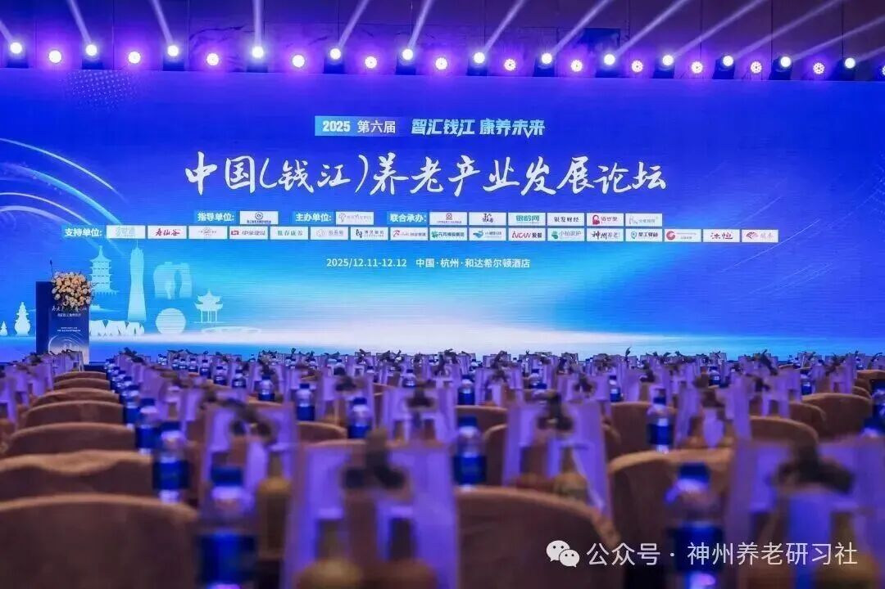
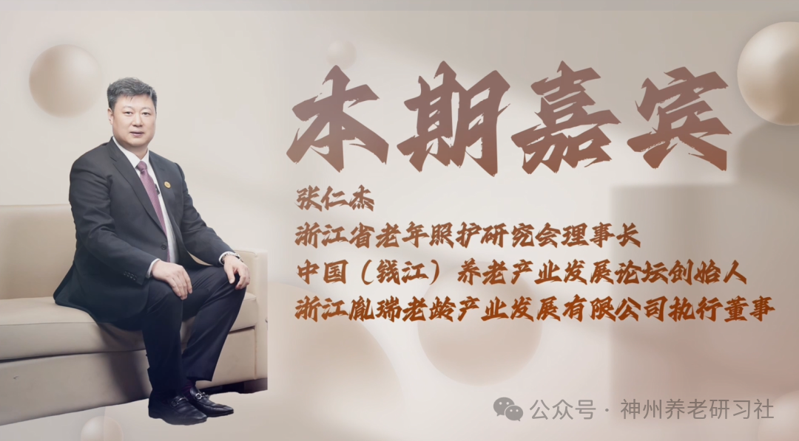

# 「神州养老银发圈」人物专访丨2025第六届中国（钱江）养老产业发展论坛创始人——张仁杰

> 公众号: 神州养老研习社
> 发布时间: 2025年12月19日 18:01
> 原文链接: https://mp.weixin.qq.com/s/nkNhqjNq0tL9-O1-CebIIA

---

**采访**

**2025第六届**

**中国（钱江）养老产业发展论坛**

超200000＋的图文直播阅读人次

两天共计500+参会人次

约300家参会企业

数十家媒体全程报道

……

2025第六届中国（钱江）养老产业发展论坛

成功举办

**本期嘉宾**

**张仁杰**

浙江省老年照护研究会理事长

中国（钱江）养老产业发展论坛创始人

浙江胤瑞老龄产业发展有限公司执行董事

**采访视频**

已关注

关注

重播 分享 赞

关闭

**观看更多**

更多

_退出全屏_

_切换到竖屏全屏__退出全屏_

神州养老研习社已关注

分享视频

，时长34:20

0/0

00:00/34:20

切换到横屏模式

继续播放

进度条，百分之0

[播放](javascript:;)

00:00

/

34:20

34:20

[倍速](javascript:;)

_全屏_

倍速播放中

[0.5倍](javascript:;) [0.75倍](javascript:;) [1.0倍](javascript:;) [1.5倍](javascript:;) [2.0倍](javascript:;)

[超清](javascript:;) [流畅](javascript:;)

您的浏览器不支持 video 标签

继续观看

「神州养老银发圈」人物专访丨2025第六届中国（钱江）养老产业发展论坛创始人——张仁杰

观看更多

原创

,

「神州养老银发圈」人物专访丨2025第六届中国（钱江）养老产业发展论坛创始人——张仁杰

神州养老研习社已关注

分享点赞在看

已同步到看一看[写下你的评论](javascript:;)

[视频详情](javascript:;)

**采访文稿**

**\>>>**

**赵元宝先生问**

品牌的合作你现在是怎么规划的？

**\>>>**

**张仁杰先生回答**

我们的公司是分成四个中心。

运营管理中心，我们所有的项目都归运营管理中心管。不管是我们的颐养项目、养老项目和医养项目、还是我们的康养项目、餐饮项目，所有服务类的产品全部是由运营管理中心来管理。

品牌合作中心的工作是确定跟外界的一些合作的确定。比如它会做品牌加盟，还有品牌联营的工作。

我们跟各种上市公司、各种大牌、大厂之间的合作的前期的沟通，后期的协调都是由品牌合作中心来完成。比如我们和寿仙谷，中海物业，新奥燃气等等一些上市公司的合作都是由品牌中心推动的。

此外，对于项目的研测，可行性报告，项目的可行性分析前期由品牌合作中心来负责。包含项目的定位、规划、设计指导，以及项目的筹建、供应链和项目的软件和硬件的系统的落地、培训和交付，就这些都是由品牌合作中心对外合作和对接的。这是品牌中心的三部分工作。

产业发展中心对接一些养老行业的人或者组织。产业发展中心首要的话是论坛，其次是我们的研究会，包括商会。

接下来我们会在芜湖和乌市共创一个大健康银发产业基金。未来可以去引进一些产品和生产类的项目，产业基金可以对它进行投资。

论坛今年推出了 7 个合伙人：一个顾问团，一个战略合作伙伴，三个板块合作伙伴，两个资源的合伙人。

钱江养老产业发展论坛已经走到第六届了，是全国养老 top 10。起码60%以上的业内嘉宾在钱江养老产业发展论坛上面做过发言和分享。

这些嘉宾中我们沟通了很多轮，最后确定了能够成为我们中国钱江养老产业发展论坛顾问的嘉宾。

顾问分成高级顾问、专家顾问和精英顾问。

高级顾问主要我们各个行业协会的一些会长，包括以前在各自领域里面都是比较出众的，最起码是对省一级的政策有干预的人。比如说原上海养老行业协会的会长，徐启华，现在是长三角大健康研究院的主任；还有江苏老年产业行业协会的会长张建平，昨天就是由张会长代表我们顾问团做致辞。

专家顾问相对较多。比如长沙民政职业技术学校的黄院长。

行业精英就更多，包括很多在品牌运营中很出色的，像美邸的王思微；产品方的，像这个世道的 s 姐等。

所以有这么一个比较全面的、专业的，有一定视野的顾问团对未来我们中国钱江养老产业发展论坛发展有很大的帮助。基本调确定下来，会越办越好，资源会越来越多。

在论坛当中，顾问团会对论坛每年的主题、内容、流程进行讨论和审议，那么最后形成一个有可操作性、有价值的一个论坛。

明年第七届中国钱江养老产业发展论坛的方案基本上会在 4 月份之前发布，这个工作由我们的顾问团经过多次的沟通后形成。

战略合作伙伴主要是论坛的一些联合承办单位。今年的有了不起的银发圈，神州养老研习社，银龄网，银发财经，林烧的达人，以及我们的金孝趣院等。

未来，针对论坛可以在全国、亚太甚至全球可以合作的，都能成为我们的战略合作伙伴。这两个都会对我们的论坛的推动起到很大的帮助。

板块合作伙伴。今年我们的品牌合作伙伴，比如说像我们的诗道、米智康，包括清雷等等这一系列的产品；以及像这个美邸、王思威，像景星、像美诗星这样的运营的品牌。

未来大家有需要类似这样的业态来落地本地的话，我们都可以做一些推荐。品牌合伙人，有成熟的产品和成熟的服务模式，如果可以进行复制的话，我们会跟他们做一定的签约。

资本合伙人有很多，比如说戴德梁行，浙商创投，以及各个省的财务投资人。我们芜湖商会的各个异地商会，每个会长都是一个资源方，每一个商会的背后都有很多的企业会员，他们也在寻求一些转型。对于好的项目的话他们也都会投，这些都是我们的资本合伙人。

项目合伙人。比如他现在有项目，在运营过程当中很吃力，或者更愿意去跟大家一起去分享，或者是说有其他的想法，愿意把这个项目做成一个更多元的、更综合的一个项目。那这样可以把他的项目释放出来，由论坛去给这些项目去做一些重新的规划，重新的定义，重新的再对接一些资源，让这些项目未来会运营的越来越好。

除了板块合伙人以外，我们还有其他合伙人。

第一个是资源推荐合伙人。如果说你在当地想进入到养老这个行业，或者想进入到银发这个行业，但是你不懂或者你没有太多的资金来投入。但我在当地有一些资源，比如在当地我认识谁？身边有哪些人想要去做一些养老的项目，我知道了这件事，觉得也是很靠谱的。那么可以推荐给我们中国钱江养老产业发展论坛。不管是这个项目是一个管理输出的项目，还是一个运营的项目，还是一个产品项目，还是一个其他什么项目。只要这个项目有收益，我们都会和你一起去共享这个收益，这是资源合伙人。

比资源合伙人在上一个层次的是区域代理合伙人，这个就比资源合伙人要求要高了。需要你够拿出时间出来，你是真心想进入到这个行业里面。区域代理合伙人我们会给他制定了三年的成长计划嗯，而资源推荐合伙人是没有三年的成长计划，但是资源推荐合伙人也可以参加我们的论坛。

区域代理合伙人可以代理我们所有论坛当中签约到的这个品牌、项目、资本等等这些资源，在当地相当于就是我们论坛的一个代理方就好了，相当于一个分论坛，一个分支联络机构。

当然你跟资源推荐合伙人不一样的就是我们还要负责让你去成长成像我们这样的人，这样的行业的、专业的精英。所以我们三年当中，我们第一年我们有春夏秋冬 4 个课程 8 天，这些都是全含在这个费用里面的。第二年的话会上半年和下半年有个两次研学，那么一次国内，一次国外。第三年的话我们在整个我们合作的项目当中会推荐一到两个你比较合适的项目去做见习，你可以做见习院长，见习主管都可以。

一个区域代理合伙人需要缴纳10 万块钱的费用，4万块钱是留作我们的合作保证金，三年以后会返还给你。另外6万块钱以每年2万块钱作为你的成长基金。未来这2万块钱所有发生的，不管是课程还是研学的费用都含在里面了，只要出交通费用就可以了。

资源推荐合伙人也会有会产生一点点的费用，三年会有 5000 块钱的报名费，当中 2000 块钱也是返还给你的，另外 3 000 块钱是每年参加钱江养老产业发展论坛的成本。

这些基本上就形成了我们合伙人的机制。合伙人机制在于能够让我们论坛所收集的各种资源得到更好的释放，我们论坛这么多年来积聚了很多的资源在上面。我们已经到了一个可以去释放的时候了。

现在我们会做一些很落地的一些事。

今年我们首先做了院长联盟，我们首先要把院长给保护好、服务好，给他们更清晰的发展的通道。成立院长联盟我们释放了很大的诚意，我们院长联盟是不收费的，但是论坛要对你进行评审，就是你需要是颐养项目的一把手院长。如果你是医养结合型的医院，可以试着去申请。

那么我们会给你释放的个权益包括。首先就是你可以免费的参加我们每年的养老产业发展论坛。第二个的话是你可以优先报名参加我们每个星期一次的院长沙龙分享会。

院长沙龙分享会报名，每一期只有 10 位，如果你没有报进的话，你可以作为观众。一个院长每年最多做一次承办。

如果你有想要问什么问题？其他的9位院长可以帮助你来回答，给你一定的参考。这个很有意义，能够帮助到我们的院长，解决运营当中的碰到的一些疑难问题，用院长帮助院长，这个是一个非常温暖的、非常有效率的一件事情。

除此以外，我们的院长论坛当中，还可以推荐一些我们的行业精英，或者是说专家学者，可以参加我们的一些研讨会，参加我们的一些论坛。

每年我们的院长论坛，可以接受我们的一次论坛的专访，那这一些都是需要你先申请，我们没有费用，我们需要的是关注院长这个群体。我们院长好了，这个院才会好。

因为现在的院长跟以前不一样，以前的院长管好服务就行。现在院长还要管好风险，管好营收，还要管好品牌，还要管好发展，很多事情要做，所以院长联盟是所有运营项目当中最核心、最有价值的资产。

所以论坛运管当中我们也意识到了，今年就是会把这一块的工作以论坛院长联盟的方式呈现出来。这次我们首批会有20家，那么后面的话我们会每个月会释放一定的名额。

如果各位院长有兴趣的话，你认为在过程当中你既可以帮助到大家，或者你也有些问题需要大家来帮助你来解决的话，我们也欢迎您能够和我们的这个论坛组委会联系，我们也有论坛小程序，可以在论坛小程序上报名。

我们说的这个论坛整个的部分就是这样子，所以黄火亮他负责更多的就是产业发展这一块，他需要链接到每一个对银发产业有兴趣的人和组织。

昨天我们余少会长也说了，就是银发不是 361 行，银发是可以链接 360 行，各行各业加银发都能再做一遍。在这件事情上来说，我们深刻感受到了未来我们以论坛为核心的资源整合的价值。

我自己现在主要是抓一些科技的项目，比如说资本的科技，我们今年和几个专门负责资本的资金共建了一家企业，这个企业未来会投我们的养老项目和投我们的产品，但是都是需要我们胤睿来做认证，胤睿来出报告，然后他们才会投。

我们会有一个人才的平台，因为毕竟我们做了这么多年来的论坛，实际上它主要的就是围绕着学习，围绕着交流围绕着合作，更多的还是在管理人才的建设上面。

今天和昨天来很多的都是院长在听，今年我们会有院长联盟会发布，明年可能我们会发布厨师长联盟，后年我们可能会发布后勤组长联盟，再后年我们可能会发动护理组长或者护理部长联盟，因为我们觉得这些人需要，我们需要有更好的机制去帮助他，去爱他们。

我运营做了这么多年来，我现在开始转到产品。我觉得未来我们胤瑞和论坛会带给大家一些银发的产品。这些年我看到一些产品起起落落落，我很深知产品的逻辑是有问题的。一方面是逻辑有问题，一方面是准备不够充分，还有部分就是资源链接不到位，最后一个就是团队的能力还不够强，但这些我们论坛，我们企业，都可以来解决。所以说就是第三块是产品科技。

最后一块是数据科技。现在正在跟几个方在谈，如何建立一个全域的这个论坛的数据。每一个演讲嘉宾在论坛上面谈到的一些内容，未来都可以形成一种数据。大家想去取就取，想去看就看，只要你在我们的数据当中发出这个你的检索，发出你的疑问，我们的数据都会通过 AI 的方式能够为你去完成一个非常专业的解答和专业的这么一个方案。

**\>>>**

**赵元宝先生补充**

那是不是比如说从第一届到第六届，所有专家的演讲的视频内容，我们都喂给这个智能体。像刚才的发言的王思薇讲这个适能适时照护的内容，你要有这方面的问题，就会用王老师的智能体和他过去多少年的经验来帮你做解答。

**\>>>**

**张仁杰先生回答**

嗯。三十而立，四十不惑，五十知天命。现在科技在发展，我们每个人都很长寿，我们要做的事情有很多。当一个人到 60 岁的时候，可能他是处于对于人生和这个社会价值贡献最大的时候，我们行业当中很多的精英也是这样子。

我们希望把每一位的精英的智慧通过数据的方式留在一个平台上。未来不管是小白还是小小白，进入到这个领域里面的时候，他们可以不用走那么多弯路，可以缩短他们对这个行业的一种适应期，他们可以有更好的准备去进入到这个领域。这是我们论坛做了这些年的一些想法，要把价值的事物通过数据把它留下来。

**\>>>**

**赵元宝先生补充**

我觉得这个挺好的。比如说我们要进入一个行业，第一先去找这个行业的大咖，这是最快的，最快的方式。

你如何在最短的时间内成为这个行业大咖？先跟这个行业的大咖交朋友，跟他们聊天，这是你进入，转型的最快的方式。

然后去参加各种各样的论坛、活动、展会，然后再去实践，这个是成长最快的。

其实我们就打造了这样一个平台，通过论坛积累这些嘉宾的智慧，他们的经验，通过数字化的方式把它整合到这个平台上，包括我们还有研学沙龙。然后花最短的时间你就可以成为这个行业专家。

**\>>>**

**张仁杰先生回答**

链接到你想要的、我们为你设计的以及行业当中比较可以认同的一些基本的认知。

现在很多做养老，他也知道养老很好，他实际上手上也有很多资源但不敢做。那一方面是之前有人做失败了，还有一方面的确做这件事情对他来说是很陌生。

我们如何缩短他对这一个行业的基本认知，最起码基本不会出错。让你能够更快的，更好的能够进入到这个领域。说一千次一万次不如做一次。只有做了你才会再往前再去走。

19 年我就是这么过来的，明年是我的 20 年，我给自己也有一个挑战。

明年的话我想跟 1000 位行业里面的同路人做一个沟通，这个挑战还是很大的。以各种方式不一定是像我们这样的也可以在线上。

我想真切的了解到我们明年在论坛当中和这 1000 位我们行业同路人之间的这个沟通的感受。

我跟我们的团队说，明年我们争取对 200 个项目进行一个咨询，哪怕是无偿的也是没有关系。对这些项目的指导和沟通，会让我在明年的论坛里面会有一个比较充分的一个数据，毕竟每年的数据都在变。

这两件事情对我来说是有一定的挑战的。那这两件事情的沟通会指向我未来。

有人问我说：张总你未来会做成怎么样的一位养老的专家？我说谈不上专家，养老里面有很多的专家。对我来说，我 19 年前以投资人的身份进入到养老，我不是单纯的职业经理人，所以未来我大概率会成为一个银发产业的投资顾问。

如果大家觉得我很专业，那么可以和我去聊一聊。我觉得我会把一些真心话，19 年里面的一些感受，看到的一些问题，包括一些个人的见解会给到你，而且我的灰色地带会很少，基本上就是比较笃定的行还是不行。那么从操作层面上来说都有可能，但是从落地这件事情上来说，我给到你越笃定对你来说越有帮助。

希望能够把我的了解到的这些能够有价值的东西，能够通过各种方式能够给到更多的养老人，毕竟中国钱江养老产业发展论坛有一个是不够的。我们希望除了一个张仁杰以外，还有更多的张仁杰。我指的是从事 19 年还能保持初心，还能对这个行业这么热爱，带着梦想，带着团队，带着成功的项目去建设更好的中国养老产业发展之路。

**\>>>**

**赵元宝先生补充**

我是觉得就是，有能力的人很多，聪明的人很多，但是我觉得是保持热情，一直能干的人其实不多。

很多人的热情都是坚持了两年、三年甚至更短，他就不坚持下去了。

我是觉得就比如说钱江养老论坛从第一届到今年第六届一直这么发展，包括你昨天会上也在说我们至少得做10届、20 届的这样的这个想法。一开始做这个的初心肯定是说我们想搭建一个平台，让大家在这个平台上有所收获，但是在这个平台发展的过程当中有了新的一些资本、新的力量的加入。

我现在听下来，我觉得其实你在做了一个基于银发产业的一个基于你的优势的一个生态。这个生态里面它有空气、有水，它有土壤，它有阳光，那基本上我们把这些东西都做到了。我们会有载体，我们作为以论坛作为载体，各方面的人员都会进来，而且我们这个载体会把各方面人员的智慧和经验都留在这里。

我们的认识这么长时间，我是觉得整个的钱江论坛它是就像一个土地一样。然后每个人过来这里插个苗，这里栽个树，我们负责提供阳光雨露，提供这个大的环境。因为你在组这个生态，然后这样的话不管是小苗也好，小苗我就给你多浇点水，给你多施点肥，然后让你长。有些是大树，那我们希望大树能发挥大树的力量，能发挥专家力量，然后共同把这个生态做起来。

当这个生态起来的时候，这个时候你发现：外面的资本也好，这个其他的一些行业也好，它因为你的生态已经能够自我循环开了。

现在，从外部的资源，商会的资源，包括从人才培养的资源，品牌的资源，包括城市合伙人的资源，其实我们已经都具备了。

然后我们有一个载体，这样的话，不管是你是什么，只要是你对这个行业热爱，你愿意从事这个行业，我不管你是专家小白，还是有一定基础的，还是没基础的，你来这里之后，在我们钱江养老产业论坛上你都能找到自己的位置。

你不光能找到位置，你还能找到下一步你往上升的途径和路径，而且在这个途径和路径当中你还不是一个人，我有老师帮助你，我有同伴和你同行，我有同行跟你同行。这样的话我觉得这个事情才能长久，别的地方也在做各种各样论坛，但是别的论坛可能就是搭建个平台以办会而办会。

我们不是这样，我们办会，那只是一个载体，只是个形式。

**\>>>**

**张仁杰先生回答**

论坛当时办第一届的时候，我们那个时候就是有说过这么一句话，就是养老生态共建者。

但是后来觉得这句话有点大，我们要落到点上去。从我们第一届的起航，到第二届的融合，到第三届的跨界，到凝聚，到创新，到这一届的智慧。每届都有一个主题。

就像你说的，我们会让我们钱江养老产业发展论坛的土壤始终保持非常适合养老生长的环境。

无论你是做过的，失败了，还是做得很好，还是没做过；无论你有钱，还是没钱，有资源，还是没资源都可以。

我说秘诀 9 个字。第一个是**早入行**，因为对于未来说你现在的入行越早越好。今天就比明天好。

第二个的话叫**真热爱**，或者叫真心爱。因为你只有爱他，真心想通了，我去做这个事情。因为养老它是银发产业，它有它的魅力。像我们俞潮会长说的叫种田得谷，养老得福，你会得到福报的，它是一个很有魅力的一个行业，所以要真心爱。当你真心爱它的时候，你就会发现所有的困难都是对你的是一种考验，实际上是在帮助你成为一个你要成为的一个人。我这些年就是一直这么过来的，我看问题我是很兴奋的，除了那些致命的问题和重复的问题以外，一些新的一些我觉得一些客观的问题对我来说都是非常非常兴奋的，因为我们的成长，我们的发展，我们的壮大是通过解决各种问题来实现的。所以说这个我说要真心爱。

第三个的话要多学问，就是说我们在过程当中会碰到很多问题，怎么去解决呢？要去学问。问做的好的人和问买单的人，你为他提供服务，你就问他需要什么？不要怕不好意思。在做的过程当中，当你碰到困难的时候，你可以去问同行，

所以我们说论坛是可以给你解决你多学问的部分。早入行，真心爱那是你自己的部分。论坛会给你提供大量的经验和价值，只要你愿意，只要你决定进入这个行业，我觉得到我们钱江养老产业发展论坛，一定会让你如愿。

**\>>>**

**赵元宝先生补充**

都能找到位置；都能找到路径；都能找到同行的人。

**\- 结束 -**