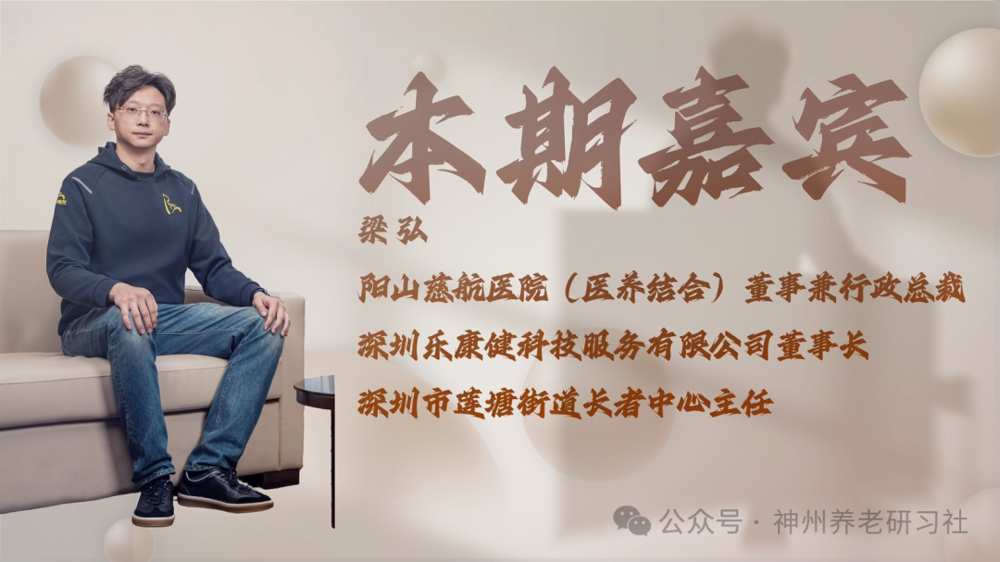

# 「神州养老银发圈」人物专访第九期——阳山慈航医院（医养结合）董事兼行政总裁 梁弘

> 公众号: 神州养老研习社
> 发布时间: 2026年3月18日 08:57
> 原文链接: https://mp.weixin.qq.com/s/5VxhPcih8E_3ypfFXqW-ZA

---

**采访**

**2025第六届**

**中国（钱江）养老产业发展论坛**

超200000＋的图文直播阅读人次

两天共计500+参会人次

约300家参会企业

数十家媒体全程报道

……

2025第六届中国（钱江）养老产业发展论坛

成功举办

**本期嘉宾**

**梁 弘**

阳山慈航医院（医养结合）董事兼行政总裁

深圳乐康健科技服务有限公司董事长

深圳市莲塘街道长者中心主任

**采访视频**

已关注

关注

重播 分享 赞

关闭

**观看更多**

更多

_退出全屏_

_切换到竖屏全屏__退出全屏_

神州养老研习社已关注

分享视频

，时长20:32

0/0

00:00/20:32

切换到横屏模式

继续播放

进度条，百分之0

[播放](javascript:;)

00:00

/

20:32

20:32

[倍速](javascript:;)

_全屏_

倍速播放中

[0.5倍](javascript:;) [0.75倍](javascript:;) [1.0倍](javascript:;) [1.5倍](javascript:;) [2.0倍](javascript:;)

[超清](javascript:;) [流畅](javascript:;)

您的浏览器不支持 video 标签

继续观看

「神州养老银发圈」人物专访第九期——阳山慈航医院（医养结合）董事兼行政总裁 梁弘

观看更多

原创

,

「神州养老银发圈」人物专访第九期——阳山慈航医院（医养结合）董事兼行政总裁 梁弘

神州养老研习社已关注

分享点赞在看

已同步到看一看[写下你的评论](javascript:;)

[视频详情](javascript:;)

**采访文稿整理**

**\>>>**

**梁 弘 （先生）**

乐康健公司是我上一年在深圳前海设立的。设立的契机，是我看到“港人北上”的趋势：莲塘口岸作为香港新开的口岸之一，新闻里提到非常热闹，很多香港人北上买菜。我自己也去了好几趟体验，确实人非常多，街上能看到很多戴口罩、背背包的香港人，买完菜就回去。我判断这个趋势是不可逆的。

香港地方小、人多，养老院环境相对较差，我自己也深有体会——我奶奶以前在香港养老院住过，环境不好但当时也很难有别的选择。我在内地做过养老与医疗，对内地情况更熟悉。刚好莲塘那边有项目，我就以乐康健参与了一个街道级长者服务中心（32 床）。这对我也是新探索：我过去更多做机构养老或医院医疗，而“9073”（居家/社区/机构养老格局）这几年很热，我想实际探索社区养老怎么做；学到的方法也可以回到我原有的医院体系里，补上社区这一块。

**\>>>**

**赵元宝（先生）**

“乐康健”这个品牌原来在香港就有，还是在大陆注册的？

**\>>>**

**梁 弘 （先生）**

是在大陆注册的。

**\>>>**

**赵元宝（先生）**

我看到你的经历比较丰富：在香港长大、又有海外留学背景，现在事业主要在内地。香港与内地在文化上也有差异。这样的跨文化背景，对你做养老与医疗，会带来哪些不同的视角？

**\>>>**

**梁 弘 （先生）**

我从小在香港长大，对那套体系比较熟悉。香港社工很多，也有庇护工场等社会支持系统；我也接触过不少慈善组织，比如东华三院或一些教会组织，经常会做相关活动，所以这些理念在我看来并不陌生。

后来回到家乡阳山，发现当地缺少这样的机构来接纳与支持弱势群体。有些家庭因为缺少支持，会出现非常极端、令人痛心的情况。正是在这个过程中，我把香港常见的一些理念与做法带回家乡，尝试从无到有搭建服务体系，我觉得这件事很有意义。

**\>>>**

**赵元宝（先生）**

香港社工体系确实比较发达。我自己也做过社工，是中级社工师，曾在中国社会工作协会工作。2008—2009 年我们看到广州、珠海等地的社工模式，很多都借鉴了香港。

你提到你在老家做的第一个项目，我看资料里写的是“阳山慈航医院”。这家医院的初衷是服务弱势群体。你还记得当时回老家最触动你、让你决定留下来的某个瞬间或场景吗？

**\>>>**

**梁 弘 （先生）**

记得。当时要做残疾儿童康复中心，就去找那些脑瘫儿童。我以前也会思考生命相关的问题，有句话经常触动我：“比你更惨的人还有很多很多。”当真正看到那些孩子与家庭出现在我身边时，我才意识到问题有多严峻。

我从 0 到 1 开始推进，起初也不知道怎么做。当时有人给了我一个名单，我和同工一起逐家家访。看到很多家庭的现实：父母可能无法承担而离开，留下爷爷奶奶在农村照顾孩子，但老人也不知道怎么照顾，几乎看不到希望。我就是从这 6 个孩子开始，觉得自己刚好有机会、有资源、有能力，也有责任把资源与解决方案带给他们。

**\>>>**

**赵元宝（先生）**

这样的场景确实很触动人。那这几个家庭现在怎么样？

**\>>>**

**梁 弘 （先生）**

能明显看到孩子有进步，家庭层面的困难也得到缓解。其实不单是帮孩子，更重要的是减轻家人的负担。

**\>>>**

**赵元宝（先生）**

我后来还看到，疫情期间你的医院曾成为隔离点。你们当时坚守一线，会害怕吗？这段经历对你和团队带来了什么影响？

**\>>>**

**梁 弘 （先生）**

那时医院还在筹备期，甚至还没开业。2020 年春节前我们准备开业、装修都好了，突发疫情后，政府把我们定为隔离点。我们也接受了——因为我们是单间，符合隔离点要求。

当时我还没招到人，就我和一个助理两个人开始张罗，把生活用品布置好，按卫健部门的指示做台账、出入管理与消杀等工作，就这样启动了。说不怕是假的，但有个信念支撑我：国家需要你的时候，匹夫有责。

**\>>>**

**赵元宝（先生）**

医院大概多大规模？

**\>>>**

**梁 弘 （先生）**

医院是 69 床的一级综合医院，配套一个 200 床的养老院（在镇上）。另外在乡镇还有一个二级精神专科医院。

**\>>>**

**赵元宝（先生）**

现在运营状况怎么样？

**\>>>**

**梁 弘 （先生）**

几乎长期满床。当地是小县城，医疗和养老机构供给不足，很多群众经济条件也比较困难；如果不在当地就医，就得去市里甚至广州，所以当地存在刚需。

**\>>>**

**赵元宝（先生）**

阳山属于哪个城市？

**\>>>**

**梁 弘 （先生）**

清远市。

**\>>>**

**赵元宝（先生）**

我资料里还看到你父亲在家乡设立了奖学金。你现在做医疗与养老，也在做公益。外界可能会觉得这是“子承父业”。你觉得你和父辈在公益这件事上，有什么相同与不同？

**\>>>**

**梁 弘 （先生）**

我们家从爷爷那一辈就开始。我爷爷是中山大学毕业生，后来被安排到阳山做校长/老师，帮助学生解决了很多实际问题。爷爷九十多岁时在广州养老院身体很差，我见到一群八十多岁的老学生去探望他。我当时很震撼：一个人做过什么，能让这么多年后仍被尊敬？我理解这是一种善心与将心比己，真正去解决别人的人生难题。

我父亲当年在阳山做过知青。他一辈子很后悔没有读成书。后来有机遇去了香港，赚钱后回到家乡，第一件事就是支持家乡优秀学子。90 年代起做助学，做了二十多年。

**\>>>**

**赵元宝（先生）**

资助总量有统计过吗？

**\>>>**

**梁 弘 （先生）**

没有系统统计。早年奖学金金额不大，大家也更珍惜。现在物价上涨，“一点点”帮助可能有限，所以我把公益重心转到残疾儿童、自闭症孩子、事实孤儿等群体。我们有社工团队筛选：既有困难、又上进、品德好的人，我们会尽力支持。

**\>>>**

**赵元宝（先生）**

这些爱心资金主要通过社工组织来做？你们会和公益基金合作吗？

**\>>>**

**梁 弘 （先生）**

目前主要靠自己捐赠，通过社工组织定点筛选与帮扶。

**\>>>**

**赵元宝（先生）**

会有外部爱心资金进来吗？

**\>>>**

**梁 弘 （先生）**

有合作。我们和广州市残疾人基金会有合作项目：阳山慈航医院做了一个“亮起来行动”。因为县城医疗条件相对匮乏，累积了不少白内障患者，我们通过基金与慈善资金帮助支付白内障手术费用。最高峰时一年做了接近 4,000 例。

**\>>>**

**赵元宝（先生）**

一年接近 4,000 例，规模不小。

**\>>>**

**梁 弘 （先生）**

老人看不清容易摔倒，会产生各种意外；他们也想再看清家人的面孔，所以这个“亮起来行动”很有意义。

**\>>>**

**赵元宝（先生）**

回到深圳这块：你们也在做社区养老中心，并引入了香港的一些护理概念。具体有哪些内容是“拿过来就能用”的？深圳长者对这种服务理念的反应如何？

**\>>>**

**梁 弘 （先生）**

我们团队去香港看过养老机构和社区中心，学习考察，也和香港的社工组织对接过督导类服务。我的体感是：香港护理更精细化、更人性化，在失智（认知症）等方面做得更好；而内地在医养结合与中医康复方面更有优势。两者各有优点，可以结合。

我从香港带回来的主要是精细化服务内容：比如养老院日常活动行程的安排，以及各类文档归档与管理等细节。

**\>>>**

**赵元宝（先生）**

香港护理是否更强调心理、隐私等精神层面的关注？大陆早期养老管理偏“条条框框”，个性化相对少；近年随着理念引入与行业发展，长三角、京津冀等地也在做更个性化、更细化的完善。深圳这边团队构成是什么样：护理人员以当地为主？中层来自香港，还是深圳本地？

**\>>>**

**梁 弘 （先生）**

护理人员是内地的，客户主要是香港过来的。我在那边以院长身份协助生活与医疗相关的问题。

**\>>>**

**赵元宝（先生）**

内地护理人员在服务理念上会不会和香港老人产生差异或冲突？

**\>>>**

**梁 弘 （先生）**

我们要求能讲粤语，沟通更顺畅。香港来的客户很多也有内地生活经验或亲友资源，所以文化冲突没那么大；纯粹在内地完全没有资源的香港老人，相对较少考虑北上。

**\>>>**

**赵元宝（先生）**

你现在同时运营医院、养老机构、康复中心等，形态不同。现在哪一块更难？最大的挑战是什么？

**\>>>**

**梁 弘 （先生）**

目前医院相对更难。县城医疗人才不太容易留下来，叠加医保政策等因素，医院经营压力会更大，用工成本也高。

**\>>>**

**赵元宝（先生）**

医院是全科室吗？

**\>>>**

**梁 弘 （先生）**

我们是“小综合、大专科”。

**\>>>**

**赵元宝（先生）**

我看到你提到未来想用 AI 技术为更多老人提供服务。你想象中的“AI 养老”是什么样？它最能解决的痛点是什么？

**\>>>**

**梁 弘 （先生）**

我现在也在做一个文化养老项目，叫“静肖区院”。我们希望通过“书香养老”来达到延缓认知症发作的目的，满足老年人的精神需求。

很多老人孤独、不愿社交，我们通过线下读书会把老人带出来社交。我们不以“卖书”为目的，也不强制必须阅读，更重要的是让他们分享、让大脑思考。我们也做朗诵队，让他们有输出。

我也在考虑利用 AI 技术：比如开发一套“解读书籍”的工具，生成陪读资料与讨论内容；通过交流累积对话素材与用户画像，进而更持续地陪伴，成为“好朋友”，并希望未来能帮助解决他们生活中的一些问题。新老年人普遍会用智能手机，这一点很关键。

**\>>>**

**赵元宝（先生）**

未来是否也会做回忆录、传记这类服务？

**\>>>**

**梁 弘 （先生）**

会的。之前也有人咨询过，我们有这块业务。

**\>>>**

**赵元宝（先生）**

昨天论坛上也提到“学习是最好的养老”。很多老人对物质的需求反而没那么强，心理与精神层面的需求更大。我看到你有哲学背景，也提到“以生命影响生命”。做了这么多医院、公益、养老之后，这句话你现在怎么理解？

**\>>>**

**梁 弘 （先生）**

有点像昨天刘华院长分享的：你要变成一道光，要发热、要温暖别人。我感觉是一脉相承的。

**\>>>**

**赵元宝（先生）**

最后一个问题：对屏幕前那些和你一样、正在投入养老与社会服务行业的年轻人，你想说一句什么？

**\>>>**

**梁 弘 （先生）**

我引用“静肖区院”张金总校训的一句话：多学习，你的余生不会变老，只会变好。

自2010年创刊以来《神州·养老》始终致力于成为中国养老领域的深度观察者、专业思考者与温暖陪伴者。

在超过十五年的时光里，本刊秉承“记录时代、服务银龄”的初心，深入行业一线，聚焦政策解读、产业趋势、运营实务与人文关怀，出版了数百期厚重而富有洞察力的内容，积累了深厚的行业信誉与读者基础。

随着时代发展与阅读习惯变迁，《神州·养老》主动拥抱变化，将这份深耕养老领域的专业积淀与媒体职责，全面延伸至线上，打造了“神州养老研习社”等新媒体矩阵，延续了杂志的严谨基因与人文温度，通过公众号、视频号等平台，以更及时、更生动、更互动的方式，持续为行业从业者提供前沿资讯、实战干货，并为广大银龄朋友传递有价值的生活知识与积极老龄化的精神力量。

从铅墨纸张到数字图文，改变的是载体，不变的是我们对中国养老事业始终如一的专注、记录与陪伴。站在新的起点，《神州·养老》的品牌精神将继续承载于每一篇用心的内容中，持续为中国银龄产业的进步贡献智慧与力量。

**\- 结束 -**