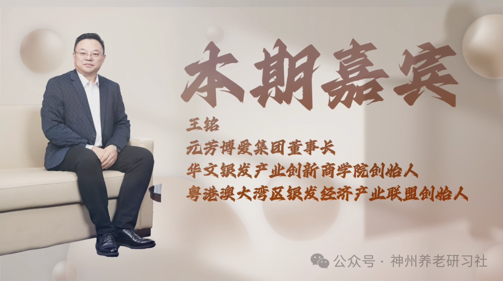

# 「神州养老银发圈」人物专访第二期——元芳博爱集团董事长 王铭

> 公众号: 神州养老研习社
> 发布时间: 2026年1月1日 10:15
> 原文链接: https://mp.weixin.qq.com/s/7gZmeIRJkZCMw6LbhmluhQ

---

**采访**

**2025第六届**

**中国（钱江）养老产业发展论坛**

超200000＋的图文直播阅读人次

两天共计500+参会人次

约300家参会企业

数十家媒体全程报道

……

2025第六届中国（钱江）养老产业发展论坛

成功举办

**本期嘉宾**

**王铭**

元芳博爱集团董事长

华文银发产业创新商学院创始人

粤港澳大湾区银发经济产业联盟创始人

**采访视频**

已关注

关注

重播 分享 赞

关闭

**观看更多**

更多

_退出全屏_

_切换到竖屏全屏__退出全屏_

神州养老研习社已关注

分享视频

，时长45:04

0/0

00:00/45:04

切换到横屏模式

继续播放

进度条，百分之0

[播放](javascript:;)

00:00

/

45:04

45:04

[倍速](javascript:;)

_全屏_

倍速播放中

[0.5倍](javascript:;) [0.75倍](javascript:;) [1.0倍](javascript:;) [1.5倍](javascript:;) [2.0倍](javascript:;)

[超清](javascript:;) [流畅](javascript:;)

您的浏览器不支持 video 标签

继续观看

「神州养老银发圈」人物专访第二期——元芳博爱集团董事长 王铭

观看更多

原创

,

「神州养老银发圈」人物专访第二期——元芳博爱集团董事长 王铭

神州养老研习社已关注

分享点赞在看

已同步到看一看[写下你的评论](javascript:;)

[视频详情](javascript:;)

**采访文稿整理**

**\>>>**

**王铭（先生）**

元芳博爱成立于 2014 年，当时总部在北京。在创立公司之前，我在体制内工作了很多年，长期在中国残联任职，这段经历对我影响很深。“元芳”是我爱人名字，“博爱”则源于我在中国残联工作时接触到的一家“博爱医院”，所以就组合成了“元芳博爱”。

这个命名背后其实很朴实。随着家庭的组建和三个孩子的出生，我们又先后成立了“悦涵”“悦童”“悦阳”等公司，都是以孩子名字来命名。一方面是给家人一个交代，另一方面也是在有意识地构建一个可以代代相传的事业生态。我们的目标是打造百年企业，把家人的名字和企业绑定在一起，也意味着我们选择了一个可以长期深耕的行业，这个行业的属性和基因，决定了我们愿意、也有能力做很久。

**\>>>**

**赵元宝（先生）**

单从名字就能感受到您对家人的重视和爱。

我看到资料里提到，集团目前涉及八大产业板块。您如何定义元芳博爱在“银发经济”中的角色？是产品供应商、方案集成商，还是产业平台和生态的构建者？这些板块之间又是如何互相赋能、形成闭环的？

**\>>>**

**王铭（先生）**

企业的发展是一个渐进的过程。没有哪家企业一开始就能成为行业“塔尖”，需要在市场和自身能力的共同演进中不断升级。

在早期，元芳博爱更多被定义为“产品供应商”，主要是提供单品或做一两个项目。随着发展，我们逐步将定位升级为“解决方案提供商”，不再只是卖单一产品，而是通过多品类组合，为客户提供系统性的整体解决方案。

而到现在，我们更希望把自己定义为“生态构建者”。我们围绕银发群体的需求，搭建起了一个相对完整的生态链条：包括鲲鹏机器人、齐康医疗、悦涵智能、悦童、会照顾、华文银发等企业和业务板块。这个生态从前端的政策解读和趋势判断，到中端的产品供给与方案集成，再到后端的交付与售后服务，形成了一个相对闭环的体系。

在这个过程中，我们会协同上下游企业以及各级合作伙伴，共同服务老年人和更广义的银发群体。

**\>>>**

**赵元宝（先生）**

目前为止，我们所有的产品都是自己生产的吗？还是有部分产品是以合作方式来完成？在产品研发和生产制造端，我们是如何布局的？

**\>>>**

**王铭（先生）**

这恰恰是我们的一个特色。公司自 2014 年北京创立后，2018 年在深圳成立公司，2020 年又在中山设立公司。现在我们大概有 20 多个产品系列、七八千种单品。面对这么庞大的产品线，不可能全部由我们自己一家公司生产。

我们的模式可以概括为“自有生产 + 国内外合作”。我们与全球范围内的优秀生产商建立了长期合作关系，同时又拥有三家核心生产企业：

齐康医疗，主要负责医疗类产品的生产制造；

悦涵智能，更偏向生活电器类产品；

会照顾，则聚焦于升降类等适老辅具产品。

通过这三家生产企业，我们大概有一百多款自有核心产品，其余品类则主要通过国内外合作伙伴进行代理、经销和资源互补。

**\>>>**

**赵元宝（先生）**

也就是说，这三家核心生产企业都是我们控股或者全资的公司？

**\>>>**

**王铭（先生）**

是的，这三家都是我们的企业。整体来看，集团旗下大概有八家公司，其中 5 家为全资控股公司，另外 3 家——包括鲲鹏机器人、华文银发和四川元芳——是与高校或社会合作伙伴共同成立的合伙公司，我们均持股 70%。

这样的股权结构，一方面吸收了高校和社会资源，另一方面又能保证我们的经营理念、战略方向和落地节奏可以被有效贯彻执行。

**\>>>**

**赵元宝（先生）**

从外界看来，由于我们的产品线多、业务板块也多，有些人可能会质疑：会不会显得过于分散？在您看来，“银发经济”这条产业链的边界在哪里？集团真正的聚焦点是什么？

**\>>>**

**王铭（先生）**

这个问题其实我们也一直在内部反复思考和打磨。

从大环境看，十一五、十二五期间，这个行业大部分业务以政府采购项目（ToG）为主。到了十三五、十四五，政采仍然重要，但国家越来越强调市场化、社会化的力量。当前正处于十四五的收官阶段，未来无论是“十五”还是更长远的规划，整个行业都会更加市场化。

我们的思路是：

第一，必须“立足于生存”。目前，全国各省民政、残联等平台项目的政采业务，仍是我们的第一梯队，我们是多个省市平台的入围供应商，这是公司稳健经营的基本盘。

第二，要系统搭建市场化业务，也就是 ToB 和 ToC。如果过度依赖政府，一旦政策或者财政节奏发生变化，企业的抗风险能力就会打折扣。

所以，当前我们仍以 ToG + ToB 为主，但正在紧锣密鼓地搭建 ToC 业务体系，未来会逐步面向全国开展合作加盟。我们预计，大概在 2026 年，会正式在全国范围内推动 ToC 端的门店和合作网络。

**\>>>**

**赵元宝（先生）**

资料中提到“3+3+3+N”的经营模式。您能详细解释一下吗？

**\>>>**

**王铭（先生）**

“3+3+3+N”是我们根据自身实践提炼出的一个经营模型：

第一个“3”是**三类服务群体**：

老年人（现在我们已经把“老年”概念前移到 40+）、儿童和残障人士。这三类群体在中国人口基数极大，需求多元而刚性。

第二个“3”是**三种业务业态**：

ToG（政府项目）、ToB（经销商和企业项目）和 ToC（个人消费者项目）。

第三个“3”是**三个核心场景**：

社区、城市和产业园。一个人的生活，离不开家庭和社区，学习和工作又嵌在城市和机构里，产业园则承载着更专业的服务和示范功能。

“N”代表**无限种连接方式**：

通过上述三个“3”的组合，我们可以衍生出 N 种业务形态和协作模式，打通上下游，形成多种链接与合作的可能。

用一句话概括，就是：清晰知道我们服务哪三类群体、采用哪三种业务路径、深耕哪三类场景，并在此基础上打开 N 种合作可能性。

**\>>>**

**赵元宝（先生）**

在这样多群体、多场景、多渠道的布局下，如何保障服务质量和产品品质的一致性？因为渠道一多，管理难度就会上升。

**\>>>**

**王铭（先生）**

这是我们内部反复推演和实践的问题。

首先，对 ToG 业务来说，政府采购本身就是一套高度规范化的体系：从品牌、型号、技术参数，到供货周期、结算方式、售后要求，都有非常清晰的标准和流程。我们严格按规执行。

其次，对 ToB 业务，经销商本身大多也是围绕政采项目或者大型招投标项目展开，我们在这里更多扮演“全方位配合”的角色。对于全国经销商，我们在产品选型、标书支持、履约保障和售后服务等方面，都有一整套标准化操作流程。

第三，对即将大规模铺开的 ToC 和加盟业务，我们引入了一家以数字化系统为核心能力的合伙公司，一起打造“千店万店统一管控”的运营体系。通过一套统一的信息系统和运营标准，对每一家门店的客户服务、销售行为、库存周转进行实时管理和数据化分析。

这样一来，不论我们未来是 100 家店还是上万家店，都能确保在服务流程、产品质量和客户体验上保持一致和可控。

**\>>>**

**赵元宝（先生）**

我们的视频和内容未来会有很多创业者看到。那在选择经销商或 C 端合作伙伴时，您有哪些要求或标准？

**\>>>**

**王铭（先生）**

合作伙伴大致可以分为两类。

第一类，是本身就有相关资源或经验的单位或个人。比如当地曾经从事残疾人服务、老年人服务、康复护理、医疗器械、社会服务等相关领域的企事业单位、团队或个人。他们对这类人群有一定了解，我们可以为其提供丰富、性价比高的产品及整体解决方案。

第二类，是准备转型或者刚刚起步创业的人。现在很多人在原有行业做了很多年，感到疲惫，想投身一个有长期价值的新领域，但又对这个行业不够了解，也不熟悉如何开展业务。

对这类合作伙伴，我们会**按照不同阶段提供适配的路径**：

你可以从社区层面的“小门店”做起，哪怕只是个体工商户或很小的公司；

当能力和资源积累到一定程度，可以升级为城市合伙人；

如果有更强的资源和团队能力，可以参与到产业园级别的项目合作中。

在整个过程中，我们会尽可能通过标准化方案、一揽子服务和实景化的示范场景，帮助合作伙伴少走弯路，用比较成熟的方法论和工具体系来复制可持续的业务模式。

**\>>>**

**赵元宝（先生）**

我看到资料里提到，我们在粤港澳建了全场景体验馆。这应该是集团战略中的一个关键环节。请问，这个馆的本质是什么？是展厅、终端门店、方案验证中心，还是招商加盟的样板店？它的运作和输出模式是怎样的？

**\>>>**

**王铭（先生）**

2024 年 12 月 30 日，我们与粤港澳银发经济产业园的运营方——顺控集团正式签署了战略合作协议。随后，我们对园区内的展厅进行了系统化设计和打磨，预计在 12 月中旬正式对外开业。在正式开业之前，展厅已经接待了多批政府部门、高校和社会团体的参访。

从形式上看，它当然是一个展厅，但我们给它的正式定位是：**中国首家“全生命周期、全场景无障碍乐龄体验馆”**。

“首家”，基于我二十多年从业经验判断——全国做展厅的不少，但规模、规范程度、系统性程度达到这个层级的，目前非常少。

“全生命周期”，是我们非常核心的理念。进入展馆，第一篇章是“人生之选择”，以人生的不同起点和命运差异为切入，让大家看到人生有一些“选择”并不完全掌握在个人手里，比如出生时是否健康、是否带有先天残障等。我们从婴儿呱呱坠地，一直展示到临终关怀的全阶段支持场景。

在“人生之赛道”篇章，我们用“三辆车”的比喻来帮助理解：婴儿车、工作时期的小轿车，以及晚年行动不便时的轮椅。这是几乎每个人都会经过的典型人生轨迹。

“全场景”，指的是围绕一个人一生中最关键的三类场景——家、社区/机构、城市与公共空间——去设计产品和服务。我们在展厅里打造了一个非常重要的实景空间，叫“元芳的家”，用高度还原的真实生活场景来呈现辅具、智能设备在日常生活中的使用方式。

国家近年频繁提到“场景消费”。对我们这种辅具和适老产品来说，一定要嵌入真实场景和真实人群，才能让使用者理解它的价值：什么样的人，在什么场景下，应当使用什么样的辅具。

同时，我们又叠加了两个关键词：“**无障碍**”与“**乐龄**”。

“无障碍”已经深入人心，不只是城市道路和公共设施的无障碍，还包括家庭、社区与机构环境中的适老化与无障碍改造。

“乐龄”的理念则更多来自香港等地的实践，希望从 40+ 开始，人们就逐步强化健康意识，把“养老”变成“享老”，把老年阶段看作可以积极经营和享受的人生阶段。

因此，这个体验馆既是展厅，也是示范终端、也是方案验证平台和招商加盟的样板店。

**\>>>**

**赵元宝（先生）**

除了服务内地市场之外，我们在粤港澳做产业园和展厅时，有没有考虑国际市场？这一步在战略布局中是怎样的定位？

**\>>>**

**王铭（先生）**

我们从北京走到广东，有几个层面的考量。

第一，广东尤其是粤港澳大湾区，是国家重要的制造和创新基地，产业链完整，是做产品研发和生产制造的理想区域。

第二，大湾区距离香港、澳门很近，我们从佛山出发，一个小时左右就能触达香港，方便我们学习和对接港澳乃至日欧的先进理念和实践。

第三，从广东“出海”更具地缘优势。我们未来几年的规划，是在夯实国内市场的基础上，逐步布局海外市场，重点包括西亚、日韩和欧美。可以理解为“国内市场 + 海外市场”的双轮驱动。

所以，粤港澳银发产业园和全场景体验馆，既是我们服务内地市场的战略支点，也是面向国际市场、学习和输出的前沿窗口。

**\>>>**

**赵元宝（先生）**

您刚才提到“无碍”，我想追问一下：在您理想中的全生命周期、全场景无障碍生活图景里，元芳博爱要解决的“碍”，最核心到底是什么？

**\>>>**

**王铭（先生）**

在我看来，“碍”至少有两个层面。

第一个是**物理上的障碍**。

比如家门口的台阶很高，腿脚不便的老人根本迈不过去。如果我们通过一个小小的坡道、一个简单的改造，就能让他自由出入，这就是把一个“碍”变成了“无碍”。从家庭，到社区，再到城市公共空间，大量的无障碍和适老化改造，既是国家重点推进的方向，也是企业的重要发展机遇。

第二个是**信息上的障碍**。

随着信息化和智能科技的发展，如果一个老年人或残障人士因为听力、视力或认知方面的限制，无法顺畅获取信息、与社会连接，那这本身就是一种“数字鸿沟”。所以，我们既关注物理无障碍，也高度重视信息无障碍。

我们希望通过在社区和城市“织网”的方式，让老人在自己家门口就能触达我们的门店，解决从吃穿用度到康复辅具、信息沟通等一整套需求。比如：

听障人士可以通过助听器更好地交流；

视障人士可以通过助视设备更好地读写和生活；

行动不便者可以通过适配辅具更自由地出行和生活。

我们一直在践行自己的品牌理念：“**AI 科技，让爱无碍。**”

通过科技赋能，把“碍”逐步变成“无碍”。

**\>>>**

**赵元宝（先生）**

那目前我们在哪些产品上已经比较深入地接入了 AI 技术？

**\>>>**

**王铭（先生）**

其实我们很多畅销产品都已经接入 AI。举个最简单的例子——电饭煲。

很多家庭的传统电饭煲，需要看清楚按键、手动选择模式，对视力不好的老人来说并不友好。我们的一款畅销电饭煲，是政采项目中使用比较多的型号：

按键上带有盲文提示；

每一次按键都有语音播报，比如“快煮”“精煮”等；

更进一步，它支持语音交互。

老人只需要对着它说“元芳，在吗？开始煮饭，精煮饭。”电饭煲就会自动响应并启动程序，煮好后还会语音提醒“主人，饭已煮熟”。这就是 AI 与传统家电结合后，对视障或老年群体带来的实实在在的体验升级。

除了电饭煲，我们还有很多产品已经深度融入 AI：

机器人及智能陪伴设备；

智能电子相框；

毫米波雷达生命体征监测；

床头小夜灯；

支持语音控制的护理床等。

在展厅中，从走进门的那一刻起，灯光、窗帘、升降灶台等，都可以通过语音控制完成。

我们还引入了针对乐龄群体的“AI 电子回忆录”产品。只需输入几个关键词，例如“退休后你有多少积蓄”“你想做些什么”等，系统就能自动生成多种场景化的图景，让老人更直观地看到自己未来退休生活的可能样貌，帮助他更好地规划和想象自己的“第三人生”。

**\>>>**

**赵元宝（先生）**

这些 AI 能力的底层技术，是我们自己研发的吗？还是通过合作来实现？

**\>>>**

**王铭（先生）**

我们的技术路线是“产学研深度融合 + 生态合作”。

元芳博爱在发展过程中，一直与多所高校保持紧密合作，包括中南大学、佛山本地高校以及其他院校。我们通过产学研合作，把高校的研发能力、学生的创新能力，与我们的产品和场景结合起来。

在当下这个时代，不论是机器人、智能家电，还是各类 AI 解决方案，市面上已经有非常多成熟的技术和方案商。我们不可能、也没有必要从零开始做所有底层技术。

我们的重点是：

从众多方案商中甄选适合的技术；

把这些技术能力，与我们在银发和辅具领域的产品体系精准“嫁接”；

通过场景打磨和用户反馈，把技术真正转化为适合老年人和残障人士使用的产品。

在这个过程中，我们一方面为高校提供实践场景和实习、就业机会；另一方面，也通过这样的合作，让技术从“实验室成果”变成“真正适应市场的产品”。

**\>>>**

**赵元宝（先生）**

刚才听下来，无论是场景、产品线，还是上下游生态，规模都非常庞大。作为集团的掌舵人，您现在感受到的最大挑战是什么？是技术整合、人才匹配、资本压力，还是市场教育和认知？

**\>>>**

**王铭（先生）**

我常在公司内部说，我们面临的不是“人手不够”的问题，而是“人才缺乏”的问题。

“人手”可以完成打螺丝、搬货、执行性强的基础工作；

 “人才”则是在某一个领域具有专业积累、能独立承担责任和创造价值的人。

我们在北京、成都以及粤港澳多地的实践中发现，真正懂这个行业、愿意深耕这个赛道的人才并不多。很多人可能做过医疗、教育、地产等行业，但一旦进入辅具和银发经济领域，就会发现这里的知识体系完全不同，需要重新学习。

在我脑海中，做这个行业的人才画像，很像“综合科医生”：

一方面要懂“药学”——也就是各种辅具和产品的性能、适用场景；

另一方面要懂“疾病和人群”——不同障碍类型、不同年龄阶段的需求差异。

比如：偏瘫患者、亚健康白领、视障者、肢体残障者，他们分别需要什么样的辅具组合，如何在家、社区、机构中去匹配。这不是短期培训能解决的问题，而是需要类似医生那样，经过多年系统学习和长期临床实践才能真正成熟。

所以，我们现在最缺的是这类“既懂产品又懂人群”的专业人才。

**\>>>**

**赵元宝（先生）**

现在一方面有很多失业人群和每年一千多万的毕业生，另一方面企业又在喊缺人，这确实是个“结构性矛盾”。除了在市场上直接寻找成熟人才之外，我们集团内部有没有一套系统的人才培养机制？比如，让一个“打螺丝的人手”，有机会成长为您刚才说的“人才”甚至“人物”？

**\>>>**

**王铭（先生）**

我们在内部是有一个**人才梯队和培养路径**\*的，但现实当中也遇到不少挑战。

现在很多从业者的心态比较急，更关注“眼前收入”，我们称之为“抓钱心态”。从老板或管理者角度，我们当然希望告诉大家：“想赚钱，先让自己值钱。”但慢慢发现，很难通过说教去改变一个人的底层逻辑。

因此，我们的策略是：**更多把精力放在“选择”而不是“说服”上**。

我们会重点选择有“苗子”的人——给他一个任务，他不仅能把“1”做好，还能联想到“1.5”和“2”的延伸；

对那种长期只能把“1”做好，却不愿也不能往后多想一步的人，我们会谨慎使用，更多安排在标准化执行岗位，而不会把他纳入关键人才培养序列。

在培养体系上，每一位新员工入职，都会参加 3—5 天的企业内训，核心内容之一就是理解我们的企业文化、价值观和使命。此后，在每周或每月的晨会上，人力资源团队会带着大家在“企业文化长廊”诵读和学习我们的文化，让价值观从“墙上的标语”真正变成“日常的判断标准”。

接下来，通过一段时间的陪跑，让他们在真实业务中理解：

我们在做的是什么；

为什么这样做；

和我们的理念、长期主义之间是什么关系。

从更长远的角度看，我们其实非常需要一批能独当一面的公司 CEO 级人才。但现实是，并不是每个人都准备好、也敢于为结果负责。所以，这也是我们在未来几年要重点解决的一个课题。

**\>>>**

**赵元宝（先生）**

确实，在企业发展过程中，人往往是最大的变量。设备、场景、用户都是可见、可控的，但“人”的不确定性是最高的。

我最后一个问题是：集团的使命是“致力于人类健康，打造百年企业”。在技术快速迭代、AI 场景几乎每几个月就变化一次的时代，**您认为有哪些“不变的基石”，能够支撑企业穿越周期**？

**\>>>**

**王铭（先生）**

我们的使命是“致力于人类健康，打造百年企业”。“健康”这一需求，在任何时代、任何国家，都是真需求、刚需求。

要穿越周期，我认为关键是把握好两个字：**“变”**与**“不变”**。

**“变”，是指对时代、技术和市场变化保持高度敏感，并主动适应和拥抱变化**。

在产品开发上，我经常强调团队要“知其然，更要知其所以然”：

不是只知道“这个产品能卖”，而是要搞清楚“为什么要做这款产品”“它解决了谁的什么问题”“在新的技术条件下还能怎么升级”。

近一两年 AI 技术突飞猛进，我们就要求团队每个人都要会用数字人、DeepSeek、豆包等新工具，让科技真正为业务提效，而不是停留在概念层面。

**“不变”，则是指我们的价值观和基本做事方式不能变**。

对客户、对经销商、对合作伙伴要真诚，不能抱着“赚一票就走”的短期心态；

要有长期主义，讲诚信、讲承诺、讲持续服务；

要愿意和合作伙伴一起成长，而不是只看眼前利益。

只有在“变”与“不变”之间找到平衡，企业才能在大浪淘沙中站得住。

另外一个重要维度，是紧紧结合国家战略和政策方向。我曾在体制内工作多年，对国家中长期规划比较敏感。无论是十四五、未来的“十五”，还是更长远的 30 年、50 年的大趋势，我们都会持续关注，并围绕这些趋势去开发产品、布局产业，与更多合作伙伴一起，把“元芳博爱”这艘大船驶向更广阔、更美好的未来。

**\- 结束 -**