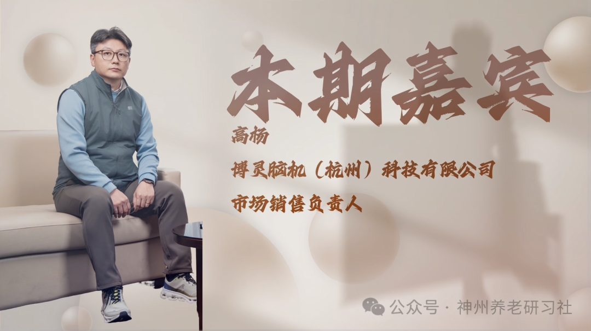

# 「神州养老银发圈」人物专访第五期——博灵脑机（杭州）科技有限公司市场销售负责人 高杨

> 公众号: 神州养老研习社
> 发布时间: 2026年1月23日 15:13
> 原文链接: https://mp.weixin.qq.com/s/wARo2prLfjRzH8VtKmbXjQ

---

**采访**

**2025第六届**

**中国（钱江）养老产业发展论坛**

超200000＋的图文直播阅读人次

两天共计500+参会人次

约300家参会企业

数十家媒体全程报道

……

2025第六届中国（钱江）养老产业发展论坛

成功举办

**本期嘉宾**

**高杨**

博灵脑机（杭州）科技有限公司市场销售负责人

**采访视频**

已关注

关注

重播 分享 赞

关闭

**观看更多**

更多

_退出全屏_

_切换到竖屏全屏__退出全屏_

神州养老研习社已关注

分享视频

，时长20:30

0/0

00:00/20:30

切换到横屏模式

继续播放

进度条，百分之0

[播放](javascript:;)

00:00

/

20:30

20:30

[倍速](javascript:;)

_全屏_

倍速播放中

[0.5倍](javascript:;) [0.75倍](javascript:;) [1.0倍](javascript:;) [1.5倍](javascript:;) [2.0倍](javascript:;)

[超清](javascript:;) [流畅](javascript:;)

您的浏览器不支持 video 标签

继续观看

「神州养老银发圈」人物专访第五期——博灵脑机（杭州）科技有限公司市场销售负责人 高杨

观看更多

原创

,

「神州养老银发圈」人物专访第五期——博灵脑机（杭州）科技有限公司市场销售负责人 高杨

神州养老研习社已关注

分享点赞在看

已同步到看一看[写下你的评论](javascript:;)

[视频详情](javascript:;)

**采访文稿整理**

**\>>>**

**赵元宝（先生）**

很多人一听到“脑机接口”，首先想到的可能是马斯克或者一些非常科幻的场景，觉得离普通人很遥远。但通过咱们的产品，比如帮助中风老人做康复，是不是可以理解为在大脑和手臂之间重新搭了一座桥？请您给大家通俗地阐述一下这个概念。

**\>>>**

**高杨（先生）**

通俗来说，确实可以这样理解。首先介绍一下，我们公司全称是“博灵脑机（杭州）科技有限公司”（简称“博灵脑机”），是浙江省的一家科技创新型中小企业，背靠浙江大学科研团队及一家上市公司。我们主要应用的是**无创非侵入式脑机接口技术**，专注于解决中风偏瘫人群的康复难题。

根据调研，我国每年新增中风人数约 400 万，存量偏瘫患者高达 2000 多万，这是一个非常庞大的群体。针对偏瘫患者常见的上肢运动功能障碍，我们希望通过这套技术帮助他们进行康复训练。

您提到的“搭桥”非常形象。正常情况下，大脑传输信号（假设为 123）给手臂，手臂接收并做出动作。但中风导致神经通路受损，信号传输变得错乱（变成 456）甚至中断。我们的系统通过佩戴在头部的神经信号采集装置，捕捉大脑发出的微弱信号，经过识别、编码后传输给外骨骼，从而带动患侧肢体进行运动。这在医学上是一个“中枢-外周-中枢”的闭环康复过程，长期训练有助于促进神经系统的功能重塑。

**\>>>**

**赵元宝（先生）**

我看咱们的产品分为医院版和家庭版，这两者有什么区别？

**\>>>**

**高杨（先生）**

主要区别在于使用场景和系统功能：

医用版：适用于医院康复科或病房。它设计为服务多名患者，配备了完善的数据管理系统，支持患者数据的本地化加密存储，保障隐私安全。设备形态类似康复机器人，可以在病房或康复大厅灵活移动。

家用版：工作原理与医用版一致，都是基于无创脑机接口技术，但专为单人使用设计。出院患者购买后可在家中独立训练。

**\>>>**

**赵元宝（先生）**

家用版的操作难度大吗？需要家人辅助吗？

**\>>>**

**高杨（先生）**

设计非常人性化。初次使用时需要简短的校准和穿戴指导，之后患者逐渐可以实现单手单人穿戴。整套设备非常轻便，重量不到 3 斤（约三瓶矿泉水重），相比传统康复设备极具优势。

**\>>>**

**赵元宝（先生）**

传统康复往往枯燥且辛苦，很多老人难以坚持。咱们这套“主动康复训练系统”有什么不同？

**\>>>**

**高杨（先生）**

我们的核心优势正是**主动康复**。

传统设备多为被动牵引，而我们强调患者的自主能动性。患者必须“想动”，大脑发出运动指令，设备采集到这个信号后才会带动肢体运动。这种“脑动+身动”的结合，比单纯的被动运动康复效果更好。

**\>>>**

**赵元宝（先生）**

目前我们服务了多少用户？康复效果如何？

**\>>>**

**高杨（先生）**

我们从临床阶段开始积累数据。在杭州的四家三甲医院以及集团旗下的东北建华医院、明珠医院，累计完成了近 300 例临床应用。

效果方面，我们使用 Fugl-Meyer 评分量表（满分 66 分）来评估上肢功能。有患者通过不到一个月的训练（通常一个疗程为 3-4 周），评分从 20 多分提升到了满分 66 分，大部分患者也能恢复到 40 多分的水平。

**\>>>**

**赵元宝（先生）**

作为一个高科技产品，大家肯定很关心费用。从长期看，它是否比传统康复更经济？

**\>>>**

**高杨（先生）**

账是可以算出来的，对家庭来说绝对更经济。

以浙江某公立医院为例，住院康复一个月的总费用（含床位、治疗费等）约 2 万多元。而我们的家用版设备售价约 4.5 万元，如果算上各地残联或政府的辅具补贴，价格会更低。

简单对比：在医院做两个疗程（约 2 个月）的费用就足以购买一台设备。买回家后，患者可以长期、高频地进行训练，无需往返医院，综合性价比非常高。当然，住院康复在急性期确诊和综合治疗上仍是不可替代的，但对于居家康复期，我们的设备是极佳的补充。

**\>>>**

**赵元宝（先生）**

目前产品主要针对上肢，未来会开发下肢康复产品吗？

**\>>>**

**高杨（先生）**

目前战略重心在上肢。

团队判断认为，上肢功能的恢复对生活质量影响更大。下肢不便可以通过轮椅、电动轮椅解决移动问题，但上肢承担着吃饭、穿衣、拿取物品等精细操作，直接关系到生活自理能力。

此外，下肢康复涉及平衡防摔等复杂安全问题，对技术要求更高。不过我们也在研究结合 FES（功能性电刺激）和脑机技术的下肢产品，未来 5-10 年会有快速发展。明年我们计划先推出一款针对手部精细动作康复的手套。

**\>>>**

**赵元宝（先生）**

这次论坛来了很多养老机构负责人，咱们的产品和养老机构结合度高吗？

**\>>>**

**高杨（先生）**

结合度非常高。中风偏瘫在 60 岁以上老年群体中高发，养老院、康养中心有巨大的康复设备需求。

同时，中风年轻化趋势也值得警惕。我们最年轻的志愿者发病时仅 20 多岁（血管畸形瘤导致），经过多年居家训练，效果也很明显。

**\>>>**

**赵元宝（先生）**

关于技术本身，大家对脑机接口的印象往往是“植入式”的。咱们的非侵入式技术成熟吗？

**\>>>**

**高杨（先生）**

脑机接口主要分为侵入式（开颅植入电极）、半侵入式和非侵入式。

博灵脑机采用的是**非侵入式**技术，无需手术，不损伤皮层。用户只需佩戴采集装置（类似手环或头戴设备），通过皮肤表面电极采集信号。这套系统可穿戴、可拆卸，非常安全便捷，目前技术已经具备了落地的成熟度。

**\>>>**

**赵元宝（先生）**

未来脑机接口技术会与 AI 结合吗？比如在认知症干预等方面？

**\>>>**

**高杨（先生）**

一定会。目前的脑机接口本身就包含智能算法，但未来与大模型、AI 智能体的结合将是方向。

想象一下，未来的康复设备可能是一个家庭机器人。患者呼叫“我要康复”，机器人自动走过来辅助穿戴并引导训练。

政策层面，国家七部委已出台政策，明确了脑机接口项目的医保收费目录。这是行业爆发的关键信号——只有进入医保，减轻患者负担，脑机接口产品才能真正普惠化，走进千家万户。

**\>>>**

**赵元宝（先生）**

最后，您最希望向面临康复难题的家庭传递什么信心？

**\>>>**

**高杨（先生）**

博灵脑机团队历时三年研发这款产品，最大的心愿就是让它尽快走进患者家庭，帮助大家减轻痛苦。

我们承诺提供价格统一、渠道透明的优质产品。同时，我也呼吁更多友商加入这个蓝海市场。中风偏瘫康复是一个巨大的民生领域，只有行业繁荣了，加上国家政策的支持，才能让更多患者早日康复，回归美好生活。

博灵脑机（杭州）科技有限公司

联系方式

**\- 结束 -**