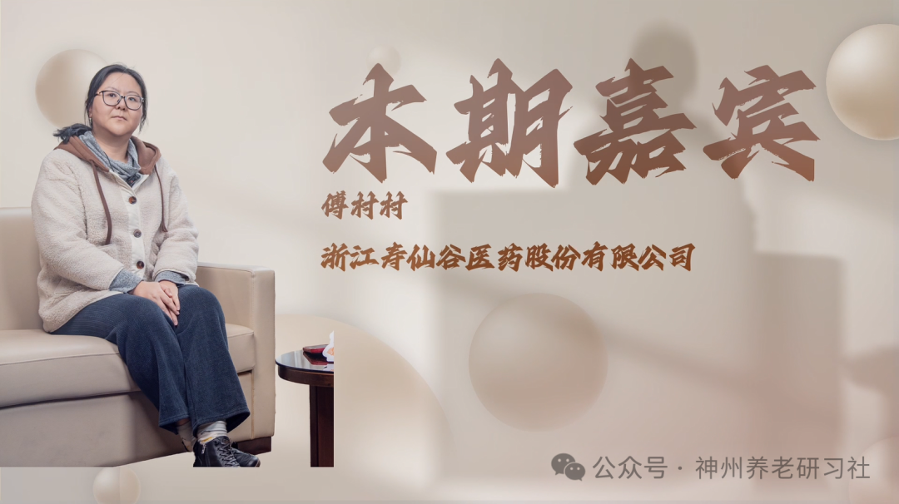

# 「神州养老银发圈」人物专访第八期——浙江寿仙谷医药股份有限公司 傅村村

> 公众号: 神州养老研习社
> 发布时间: 2026年3月3日 21:38
> 原文链接: https://mp.weixin.qq.com/s/ClmSM3FKX0OKahAJSW8UPg

---

**采访**

**2025第六届**

**中国（钱江）养老产业发展论坛**

超200000＋的图文直播阅读人次

两天共计500+参会人次

约300家参会企业

数十家媒体全程报道

……

2025第六届中国（钱江）养老产业发展论坛

成功举办

**本期嘉宾**

**傅村村**

浙江寿仙谷医药股份有限公司

**采访视频**

已关注

关注

重播 分享 赞

关闭

**观看更多**

更多

_退出全屏_

_切换到竖屏全屏__退出全屏_

神州养老研习社已关注

分享视频

，时长12:44

0/0

00:00/12:44

切换到横屏模式

继续播放

进度条，百分之0

[播放](javascript:;)

00:00

/

12:44

12:44

[倍速](javascript:;)

_全屏_

倍速播放中

[0.5倍](javascript:;) [0.75倍](javascript:;) [1.0倍](javascript:;) [1.5倍](javascript:;) [2.0倍](javascript:;)

[超清](javascript:;) [流畅](javascript:;)

您的浏览器不支持 video 标签

继续观看

「神州养老银发圈」人物专访第八期——浙江寿仙谷医药股份有限公司 傅村村

观看更多

原创

,

「神州养老银发圈」人物专访第八期——浙江寿仙谷医药股份有限公司 傅村村

神州养老研习社已关注

分享点赞在看

已同步到看一看[写下你的评论](javascript:;)

[视频详情](javascript:;)

**采访文稿整理**

**\>>>**

**傅村村（女士）**

寿仙谷始于 1909 年，是百年老字号，也是国家高新技术单位。企业拥有自研的“去壁”技术，这是我们的核心技术之一；铁皮石斛（文中简称“铁皮”）产品主打无糖。我们还拥有部分非遗工艺，主要体现在中药炮制等制药工艺上。

与行业内其他企业相比，我们的特点是全产业链布局：从育种、栽培，到深加工、再到销售，基本由企业自身完成。

我们的种植基地在金华武义。除了主力产品（孢子粉、铁皮、西红花）之外，也有多种名贵中草药材，包括“浙八味”等。

**\>>>**

**赵元宝（先生）**

种植面积很大，加起来大概一共有多少亩？

**\>>>**

**傅村村（女士）**

我们有 8 个基地，规模在金华当地算不错。

**\>>>**

**赵元宝（先生）**

主要在金华武义？

**\>>>**

**傅村村（女士）**

对，基地都在金华武义，并且都通过了有机认证，所以我们的产品也以有机为特点。我们最核心的一块基地还被评为 3A 级景区，相当于“基地+景区”的形态。

**\>>>**

**赵元宝（先生）**

现在可正常包装上市销售的产品类型，大概有多少种？

**\>>>**

**傅村村（女士）**

产品类型比较多。传统主力产品包括：去壁孢子粉、无糖铁皮。

同时我们也开发了面向年轻人的新品：比如口味更容易接受的铁皮产品（含糖/含果糖版本），以及不做去壁处理、价格更亲民的孢子粉产品。

此外还有传统膏方、药食同源膏方，以及片剂、胶囊等剂型。片剂/胶囊更适合商务人士或出行场景：孢子粉在外冲泡不便，而片剂或胶囊便于随身携带，按日服用即可。

**\>>>**

**赵元宝（先生）**

也就是做成颗粒状？

**\>>>**

**傅村村（女士）**

对，片剂有点像复合维生素片那类形式；胶囊则是一粒一粒的。

**\>>>**

**赵元宝（先生）**

那胶囊里面是液体吗？

**\>>>**

**傅村村（女士）**

胶囊里是粉剂，本质上是把孢子粉装进胶囊里。

**\>>>**

**赵元宝（先生）**

那就可以直接吞服，不需要冲泡了。

**\>>>**

**傅村村（女士）**

对，这样就不需要冲泡。

**\>>>**

**赵元宝（先生）**

那确实方便，这也算一种创新。因为以前好像更多是粉剂条装。

**\>>>**

**傅村村（女士）**

对，粉剂条装相对更传统。

**\>>>**

**赵元宝（先生）**

破壁与不破壁的区别在哪里？除了售价成本以外，在产品本身（药性/效果）方面有什么差异？

**\>>>**

**傅村村（女士）**

我们这里更核心的是“去壁”。去壁之后，相当于把外壳去掉，保留更精华的部分；有效成分可以有显著提升。按我们内部的通俗说法：吃 1 包去壁粉，约相当于吃 10 包普通破壁孢子粉。折算下来，去壁产品从“单位有效成分成本”角度反而更划算。

**\>>>**

**赵元宝（先生）**

我看到企业也是国家级非遗项目保护单位。这个非遗主要体现在哪方面？

**\>>>**

**傅村村（女士）**

主要是炮制技术。总部也会做现场展示，类似传统工艺（比如手工炒制类工艺）。像菊花等产品也采用类似的手工工艺。

**\>>>**

**赵元宝（先生）**

也就是说，产品品质首先从源头种植开始，从土壤、环境、种植技术打底；同时炮制技术对中医药产品也非常关键。有些原料很好，但炮制不当，也会明显影响效果。

**\>>>**

**傅村村（女士）**

是的。此外，我们的去壁技术也是独有的专利技术。市面上孢子粉很多，但“去壁”并不多见。

**\>>>**

**赵元宝（先生）**

但市面上我也看到很多都在宣传“破壁孢子粉”。

**\>>>**

**傅村村（女士）**

他们通常是“破壁”，不是“去壁”。

**\>>>**

**赵元宝（先生）**

这两个差别很大吗？

**\>>>**

**傅村村（女士）**

差别很大。我举个比喻：把孢子粉当作一颗山核桃。原粉就像刚采收的山核桃；破壁相当于把壳敲碎，但壳仍在；而去壁相当于把壳去掉，只吃核桃仁。破壁是“壳碎了但还在”，去壁是“壳去掉了”。

**\>>>**

**赵元宝（先生）**

也就是说，目前国内只有你们能做去壁？

**\>>>**

**傅村村（女士）**

对，这是我们的专利技术。

**\>>>**

**赵元宝（先生）**

所以消费者常常分不清“破壁”和“去壁”的区别。

**\>>>**

**傅村村（女士）**

对，这就是核心区别。

**\>>>**

**赵元宝（先生）**

研发方面每年大概投入多少？

**\>>>**

**傅村村（女士）**

这部分可以参考公司财报。

**\>>>**

**赵元宝（先生）**

我看到你们是上市公司，上交所主板，2017 年上市。

**\>>>**

**傅村村（女士）**

是的，2017 年上市。

**\>>>**

**赵元宝（先生）**

我刚才也才意识到品牌始于 1909 年。

**\>>>**

**傅村村（女士）**

对，始于 1909 年。

**\>>>**

**赵元宝（先生）**

“寿仙谷”这三个字最早就是牌子？

**\>>>**

**傅村村（女士）**

最早是药号。1909 年由李总的曾祖父开始做药号，形成“寿仙谷”这个药号品牌，家族长期从事中药相关业务并传承至今。

**\>>>**

**赵元宝（先生）**

市场端目前主要是自营还是合作？

**\>>>**

**傅村村（女士）**

我负责的部分以直营为主。直营主要是专卖店与“寿仙谷健康药房”这两类。

**\>>>**

**赵元宝（先生）**

覆盖城市主要在哪些？

**\>>>**

**傅村村（女士）**

全国都有，但重点在江浙。比如杭州有 14 家门店。除直营外，我们也做渠道合作，主要是商超与药线：商超如杭州的世纪联华；商场专柜覆盖杭州大厦、解百、万象城等相对高端渠道。药线合作包括九州大药房、老百姓、海王星辰等连锁。

**\>>>**

**赵元宝（先生）**

我注意到你们也把研学与文旅加进来了？

**\>>>**

**傅村村（女士）**

对，我们也做研学、文旅和工业旅游。会组织小朋友到武义基地参观，基地有百草园，可以做中草药辨识与文化讲解，也会做一些中草药相关的手作体验课。

**\>>>**

**赵元宝（先生）**

这次论坛来了很多全国各地做养老的机构与个人。未来与这类群体会有哪些合作打算？

**\>>>**

**傅村村（女士）**

他们的客群与我们的客群有较强交叉，可以共同赋能。比如在养老机构场景，我们可以为其客户提供服务：像养生茶歇、职业药师到场宣讲、体质检测等。我们也有相应设备支持（如 AI 问诊、手诊等）。

**\>>>**

**赵元宝（先生）**

这种合作模式是：机构来销售你们产品，还是直接在他们的产品体系里销售？

**\>>>**

**傅村村（女士）**

都可以。我们先对他们的客户提供服务，形成认可后，可以通过合作方式由他们销售我们的产品，我们进行供货。

**\>>>**

**赵元宝（先生）**

其他省份如果要找你们合作，通常怎么对接？

**\>>>**

**傅村村（女士）**

我们按区域分工，不同省份对接对应区域负责人。

**\>>>**

**赵元宝（先生）**

如果合作方本身已有线上线下渠道（比如原来做其他品类），想丰富品类，你们怎么合作？

**\>>>**

**傅村村（女士）**

这类合作方更了解自己的客群，不一定非要用我们的主营产品，也可以根据他们的需求做定制产品。

**\>>>**

**赵元宝（先生）**

定制是指？

**\>>>**

**傅村村（女士）**

例如有合作方反馈其客户多为心脑血管问题的老年人，我们可以结合其诉求，定制更符合其定位的产品并提供。

**\>>>**

**赵元宝（先生）**

也就是说，你们可以基于客户群体帮他们做产品设计研发；品牌是用寿仙谷，还是他们自己的？

**\>>>**

**傅村村（女士）**

可以联名，也可以使用我们的子品牌。

**\>>>**

**赵元宝（先生）**

子品牌有哪些？

**\>>>**

**傅村村（女士）**

子品牌有很多。主品仍以赤芝孢子粉为主；子品牌可以承接破壁孢子粉及其他功能性产品。

**\>>>**

**赵元宝（先生）**

我看到你们也是中药灵芝、铁皮石斛 ISO 国际标准制定承担单位。

**\>>>**

**傅村村（女士）**

对，我们是 ISO 国际标准制定承担单位。

**\>>>**

**赵元宝（先生）**

这个大概是什么时候开始的？

**\>>>**

**傅村村（女士）**

2010 年就有了。

**\>>>**

**赵元宝（先生）**

也就是说你们参与制定？

**\>>>**

**傅村村（女士）**

我们主导。

**\>>>**

**赵元宝（先生）**

明白。

自2010年创刊以来《神州·养老》始终致力于成为中国养老领域的深度观察者、专业思考者与温暖陪伴者。

在超过十五年的时光里，本刊秉承“记录时代、服务银龄”的初心，深入行业一线，聚焦政策解读、产业趋势、运营实务与人文关怀，出版了数百期厚重而富有洞察力的内容，积累了深厚的行业信誉与读者基础。

随着时代发展与阅读习惯变迁，《神州·养老》主动拥抱变化，将这份深耕养老领域的专业积淀与媒体职责，全面延伸至线上，打造了“神州养老研习社”等新媒体矩阵，延续了杂志的严谨基因与人文温度，通过公众号、视频号等平台，以更及时、更生动、更互动的方式，持续为行业从业者提供前沿资讯、实战干货，并为广大银龄朋友传递有价值的生活知识与积极老龄化的精神力量。

从铅墨纸张到数字图文，改变的是载体，不变的是我们对中国养老事业始终如一的专注、记录与陪伴。站在新的起点，《神州·养老》的品牌精神将继续承载于每一篇用心的内容中，持续为中国银龄产业的进步贡献智慧与力量。

**\- 结束 -**