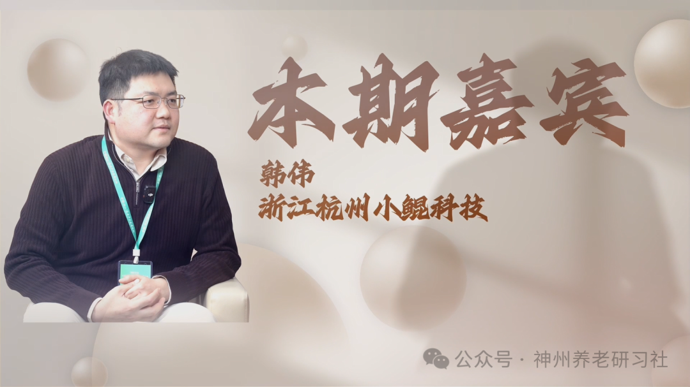

# 「神州养老银发圈」人物专访第六期——浙江杭州小鲲科技 韩伟

> 公众号: 神州养老研习社
> 发布时间: 2026年2月2日 16:35
> 原文链接: https://mp.weixin.qq.com/s/aEAvyBr_JBmWeMI70DoAlQ

---

**采访**

**2025第六届**

**中国（钱江）养老产业发展论坛**

超200000＋的图文直播阅读人次

两天共计500+参会人次

约300家参会企业

数十家媒体全程报道

……

2025第六届中国（钱江）养老产业发展论坛

成功举办

**本期嘉宾**

**韩伟**

浙江杭州小鲲科技

**采访视频**

已关注

关注

重播 分享 赞

关闭

**观看更多**

更多

_退出全屏_

_切换到竖屏全屏__退出全屏_

神州养老研习社已关注

分享视频

，时长23:44

0/0

00:00/23:44

切换到横屏模式

继续播放

进度条，百分之0

[播放](javascript:;)

00:00

/

23:44

23:44

[倍速](javascript:;)

_全屏_

倍速播放中

[0.5倍](javascript:;) [0.75倍](javascript:;) [1.0倍](javascript:;) [1.5倍](javascript:;) [2.0倍](javascript:;)

[超清](javascript:;) [流畅](javascript:;)

您的浏览器不支持 video 标签

继续观看

「神州养老银发圈」人物专访第六期——浙江杭州小鲲科技 韩伟

观看更多

原创

,

「神州养老银发圈」人物专访第六期——浙江杭州小鲲科技 韩伟

神州养老研习社已关注

分享点赞在看

已同步到看一看[写下你的评论](javascript:;)

[视频详情](javascript:;)

**采访文稿整理**

**\>>>**

**韩伟（先生）**

我们公司最早的业务是做保险相关服务。老板很早就意识到，“银发经济/适老化”可能会成为国家接下来重点关注的方向。基于这个判断，我们决定响应政策，开发符合这一方向的产品。

结合自身资源和能力评估后，我们认为智能穿戴设备更适合切入。所以大概从两年前开始，一直在选品、研发、注册，做到今年 6 月，这款产品才算真正打磨成熟，才敢面向大众。

**\>>>**

**赵元宝（先生）**

你们在选品时为什么从可穿戴设备切入？当时也看过其他方向吗？

**\>>>**

**韩伟（先生）**

这里面也有一个契机：华为把 Watch D2 这类“可穿戴血压手表”的概念带了起来。我们判断头部品牌已经完成了市场教育与路线验证，所以选择顺势进入。

我们当时也看过很多产品，最终认为华为这类方案的血压功能已经相对成熟。我们希望在成熟路径的基础上，把产品更快推向市场。

**\>>>**

**赵元宝（先生）**

我也用华为产品。我想了解：基于华为这样的路线，你们与它的差异在哪里？尤其是算法和后端能力。

**\>>>**

**韩伟（先生）**

华为的产品用料确实很好。我们在做产品分析与拆解时也能感受到，他们在供应链和整体配置上比较“良心”。

但如果说这类产品的核心，我认为是算法。无论气囊、芯片都重要，但并不是决定性的关键；算法好坏决定了血压测量精度。

我们在算法上投入了很长时间：团队负责人是海外留学背景，在这个领域深耕多年。我们也敢说，算法能力与头部产品相比不落下风。更关键的是，我们的手表获得了二类医疗器械认证；如果算法精度不够，是拿不到这个认证的。

在掌握核心能力之后，我们想进一步探索差异化定位。华为的路线更偏年轻化，功能更丰富、成本也更高；**我们的目标群体更偏银发/适老人群，他们可能不需要太多复杂功能**。我们在保留“血压测量”这一核心能力的前提下，适度做功能简化，从而**把成本与定价拉到更亲民的区间**。

**\>>>**

**赵元宝（先生）**

我给父母买过传统电子血压计。相比之下，手表的优势是什么？

**\>>>**

**韩伟（先生）**

**这款产品最核心解决的是“便携性”。在慢病管理里，尤其是高血压，痛点非常突出**。

我们在分析高血压人群行为时发现：很多人并不会在血压不高时规律吃药，往往是“感觉不对/测到升高”才想起来吃降压药；但如果血压不高就吃药，又可能带来低血压风险。因此，**“实时监测”对这类人群非常关键**。

传统血压计不可能随身携带、随时掏出来测。**腕式血压计技术的突破，让“随时可测”变得现实**。

**\>>>**

**赵元宝（先生）**

采集血压数据是第一步。你们后续还提供什么服务？

**\>>>**

**韩伟（先生）**

对慢病管理来说，“采集准确”只是开头，更**关键是“采集之后怎么用”**。

我们的手表不仅是设备，还配套手机 APP（也打磨了很长时间）。**数据会同步到系统与后台；例如累计一周的数据后，系统会做综合分析，给出这一段时间血压变化趋势与管理建议**：比如运动量建议、饮食注意事项等。

我们也会持续关注。如果后台判断血压控制持续变差，会在 APP 上进行提醒；**同时支持绑定亲人，出现明显波动时也可以把信息同步给家属，提示及时就医或进一步检查**。

**\>>>**

**赵元宝（先生）**

也就是说：日常有数据列表和波动提醒；如果出现大波动，会第一时间通知子女，子女也能在后台看到父母的监测情况。

**\>>>**

**韩伟（先生）**

是的。这也是腕式血压计相对传统血压计的一个优势：数据能在 APP 上保存同步并分享。

**对很多在外工作的子女而言，最牵挂的是父母健康**。如果能通过一个设备 + APP 看到父母数据是否异常，会更安心。

**\>>>**

**赵元宝（先生）**

除了测血压，还有哪些功能？

**\>>>**

**韩伟（先生）**

血压测量方面，我们使用示波法（真气囊、有气泵）。从原理上讲，它和药店常见的鱼跃、欧姆龙等上臂式电子血压计的测量方式是一致的。

同时，我们也有 PPG 光电模组（常见运动手表背部的绿光），**可用于心率、血氧、睡眠等监测；还支持 60 多种运动监测**。整体上，我们以血压为主，同时保留部分运动健康功能，但不会做得过于复杂，便于父母辈操作。

**\>>>**

**赵元宝（先生）**

公司什么时候成立？从成立到第一款产品发布经历了多久？

**\>>>**

**韩伟（先生）**

公司是 2019 年成立的，到今年差不多 6 年。成立到第一款产品发布，大概经历了 4 年左右。

虽然今年 6 月开了发布会，但产品在去年其实已经基本打磨完成。我们在上市前做测试时发现：**早期功能做得很丰富（比如定位等），但真实使用场景里，“大道至简”。大家更需要的是健康数据准确，而不是复杂功能**。

把复杂功能去掉之后，一个明显收益是续航更长。我们的正常待机时间可以做到 7–14 天：如果测血压比较频繁（例如每天 2–3 次），实测大概 7–10 天；如果每天测 1 次，基本两周电量还能剩 10% 多。

长续航能显著降低“用电焦虑”，对老人尤其重要。比如外出旅游、走亲访友时，不必为频繁充电而焦虑；关键时刻（比如突然头晕）依然能及时测量。

**\>>>**

**赵元宝（先生）**

我们之前做产品测评也发现，“用电焦虑”是中老年很担心的问题。老人通常第一句话就会问：能用几天？要是每天都要充电，他们基本就不愿意用。

**\>>>**

**韩伟（先生）**

是的。老人不太会像年轻人那样把手表当“装饰”，他们更在意是否麻烦、是否好用，所以我们研发时特别关注续航和易用性。

**\>>>**

**赵元宝（先生）**

接下来市场端怎么规划？

**\>>>**

**韩伟（先生）**

市场推进我们以 B 端为主。

第一条渠道是药房：目前已经和益丰大药房合作，线上渠道已开始售卖，线下在逐步推进。

第二条渠道是保险：保险面向人群里年纪偏大的比例较高，产品也适合作为“伴手礼/赠品”。

第三条渠道是养老相关渠道：我们的产品定位是老人群体，但并非非常高龄的人群，更偏“父母这一代”——有一定经济能力、愿意享受生活、也有健康管理意识的人群。

**\>>>**

**赵元宝（先生）**

有没有特渠/私域那种线上渠道？

**\>>>**

**韩伟（先生）**

我们确实遇到过私域渠道。但**对品牌方来说，最大的挑战之一是价格体系管理，不能让市场价格乱掉**。

因此对经销商我们会做比较严格的准入审核，尤其会看对方是什么类型的私域。

至于真正的 C 端，我们并不以“直接销售”为主要目标。比如京东旗舰店我们也有，但更多是给消费者一个可触达售后的入口；很多用户不知道怎么联系售后，通过京东渠道能找到我们，我们提供专业售后支持。

抖音等自媒体账号的定位也更偏“使用教育”：**我们会拍摄更多产品使用场景和方法，帮助用户理解怎么用；传播为主，销售不是核心目标**。

**\>>>**

**赵元宝（先生）**

产品下一步的升级迭代怎么做？

**\>>>**

**韩伟（先生）**

这个问题非常关键。我们在展会和面对真实客户、B 端代理时发现，他们很关心：你们能测什么？除了血压还能测什么？

慢病常说“三高”，血脂相对更难测；我们认为更现实且需求巨大的方向是血糖。大家也知道，血糖要更精准通常需要见血。

所以我们的下一步方向之一，是与 CGM（连续血糖监测）企业合作：对方的血糖数据实时回传到我们的手表后台，我们在输出血压健康报告的同时，也能输出血糖健康报告。

另外还有一个更有趣的合作方向：有大型药企希望与我们深度合作，并引入某位专家的“癫痫预防”相关技术专利，尝试把这项能力植入手表。设想是基于血压、心率等终端数据的波动，提前识别癫痫风险倾向，从“将要患病”之前介入。

对我们来说，身体很多指标经过后台加工分析，可以推断出风险——比如心率、血压、体温等生命体征。**如果有设备能长期佩戴并持续捕捉数据，通过后台分析，就可能提前发现趋势性风险**。医院检查也是类似逻辑：先做检查，再结合数据判断哪些指标偏高或偏低。

**\>>>**

**赵元宝（先生）**

你们的血压数据医院会认可吗？还是只能参考？

**\>>>**

**韩伟（先生）**

我们的手表是二类医疗器械，严格意义上属于医疗器械。国家对二类医疗器械管控较严格，我们满足准入要求（例如误差小于等于 5 mmHg）。

但血压本身是波动的。医生会把我们提供的连续数据、周期分析作为参考依据；同时出于医学谨慎，通常也会在医院再做一次检查。两者结合，可以实现更早的风险识别与介入。

**\>>>**

**赵元宝（先生）**

除此之外，会不会推荐一些高血压相关产品？

**\>>>**

**韩伟（先生）**

目前暂时没有这个打算。我们更希望做专业的事情。产品推荐涉及很多责任与信息核验，必须对每个产品有深入了解；对患者而言，还是建议在专业医生指导下使用相关产品。

**\>>>**

**赵元宝（先生）**

有没有通过你们的后台干预，预防风险的案例？比如血压突然升高。

**\>>>**

**韩伟（先生）**

有。我们的指标（血压、心率等）都可以设置阈值，超过阈值会报警。除了本人收到提醒，关心他的人（例如绑定的家属）也会同步收到报警信息。

我们曾遇到一个案例让我很感动：产品发布在 6 月初，正好临近父亲节，有人买手表送给父亲。父亲在使用过程中多次测量发现血压偏高，于是去医院做了专业检测，确认是高血压前兆；之后通过用药、饮食、运动等方式做了干预。这个案例也给了我们很大信心。

**\>>>**

**赵元宝（先生）**

团队现在多少人？

**\>>>**

**韩伟（先生）**

研发团队 30 多人；销售团队十几人。整体核心团队大概 40 人左右。

**\>>>**

**赵元宝（先生）**

现在估值多少？有融资吗？

**\>>>**

**韩伟（先生）**

目前还没有到很快融资的阶段。我也希望有更多人看到这个方向的前景，愿意主动来聊。

**\>>>**

**赵元宝（先生）**

我们在采访过程中也会接触自媒体和投资人，他们会问业内有没有好的东西。后续如果合适，也可以沟通对接。

**\>>>**

**韩伟（先生）**

我也认同：好的东西应该被更多人发现、被更多人使用。被他们发现和认可，是好事。

**\>>>**

**赵元宝（先生）**

最后一个问题：同类型产品国内市场有哪些？竞争情况如何？

**\>>>**

**韩伟（先生）**

C 端知名品牌基本都有做，比如 OPPO、小米、华为等。竞争确实很激烈。

所以我们要尽快拓宽护城河：把血糖等监测做得更专业，同时深耕健康管理领域的配套体系。其他厂商更多面向 C 端消费品，**我们更希望提供一整套慢病管理方案。赛道和定位不一样**。

**\>>>**

**赵元宝（先生）**

好的，就这些问题。谢谢。

**\>>>**

**韩伟（先生）**

谢谢。

**\- 结束 -**