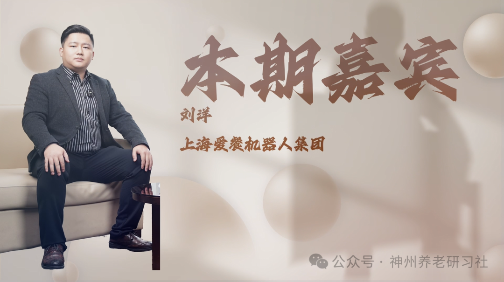

# 「神州养老银发圈」人物专访第四期——上海爱餐机器人集团 刘洋

> 公众号: 神州养老研习社
> 发布时间: 2026年1月15日 09:40
> 原文链接: https://mp.weixin.qq.com/s/PjDoXfYTqLrhyw1lZliVDg

---

**采访**

**2025第六届**

**中国（钱江）养老产业发展论坛**

超200000＋的图文直播阅读人次

两天共计500+参会人次

约300家参会企业

数十家媒体全程报道

……

2025第六届中国（钱江）养老产业发展论坛

成功举办

**本期嘉宾**

**刘洋**

上海爱餐机器人集团

**采访视频**

已关注

关注

重播 分享 赞

关闭

**观看更多**

更多

_退出全屏_

_切换到竖屏全屏__退出全屏_

神州养老研习社已关注

分享视频

，时长21:05

0/0

00:00/21:05

切换到横屏模式

继续播放

进度条，百分之0

[播放](javascript:;)

00:00

/

21:05

21:05

[倍速](javascript:;)

_全屏_

倍速播放中

[0.5倍](javascript:;) [0.75倍](javascript:;) [1.0倍](javascript:;) [1.5倍](javascript:;) [2.0倍](javascript:;)

[超清](javascript:;) [流畅](javascript:;)

您的浏览器不支持 video 标签

继续观看

「神州养老银发圈」人物专访第四期——上海爱餐机器人集团 刘洋

观看更多

原创

,

「神州养老银发圈」人物专访第四期——上海爱餐机器人集团 刘洋

神州养老研习社已关注

分享点赞在看

已同步到看一看[写下你的评论](javascript:;)

[视频详情](javascript:;)

**采访文稿整理**

**\>>>**

**赵元宝（先生）**

咱们企业总部在哪里？杭州这边是什么定位？

**\>>>**

**刘洋（先生）**

总部在上海，我们在杭州、上海都有布局。杭州这边是分公司。

**\>>>**

**赵元宝（先生）**

公司是哪一年成立的？

**\>>>**

**刘洋（先生）**

公司成立比较早，2008 年萌生创业想法，2009 年开始正式成立并推进项目。

**\>>>**

**赵元宝（先生）**

你个人之前是做什么行业？

**\>>>**

**刘洋（先生）**

我个人一直做销售，毕业后就从事销售工作。

**\>>>**

**赵元宝（先生）**

当初为什么会想到做“炒菜机器人”？

**\>>>**

**刘洋（先生）**

从公司角度看，我们三位创始人都是美食爱好者，但不擅长烹饪；他们是上海大学同期的研究生同学，创造力和执行力都很强，一拍即合就有了这个创意。2008 年有想法，2009 年正式立项。推进过程中也发现，中餐难以标准化，行业普遍存在厨师难招、难管理等痛点。我们认为“机器人厨师”是能系统性解决这些问题的方案，所以一直坚持到现在。

**\>>>**

**赵元宝（先生）**

当时国内或国外有类似团队在做吗？

**\>>>**

**刘洋（先生）**

2008–2009 年做的人不多，可能有少数几家，但路径不同。很多做的是“半自动”，需要人工辅助投放食材、加调料等。我们做的是“全自动”：人员把食材准备好，点击开始烹饪后，调料、火候、温度等由机器自动控制，人员无需再介入。

**\>>>**

**赵元宝（先生）**

让机器人学会烹炒、煎炸等动作，前期是不是需要训练？你们怎么做？

**\>>>**

**刘洋（先生）**

我们依托菜品研发团队来完成。目前菜品研发团队 20 多人，来自全国各地不同菜系的一流厨师。核心是把传统烹饪经验和过程做“数字化标准”，再编程复刻到机器上。

举例来说，一道辣椒炒肉：锅温要到多少、翻勺/颠锅的频率要达到多少，都会被精准量化，然后形成机器可执行的菜谱；同时食材用量、调料比例也会数字化录入。这样机器就能自主完成烹饪操作。

**\>>>**

**赵元宝（先生）**

中国人讲究“锅气”。机器人全电驱动，会不会少了点“灵魂”？

**\>>>**

**刘洋（先生）**

这是客户最常问的问题。传统燃气明火让人直觉觉得更有“锅气”，而我们是电驱动。但从科学角度看，“锅气”的核心是温度。传统烹饪一般能达到 180–200℃，我们的全系列机器在烹饪过程中最高温度可达 230℃，所以不存在“机器人炒菜没有锅气”的概念。

**\>>>**

**赵元宝（先生）**

设备的锅是什么材质？

**\>>>**

**刘洋（先生）**

锅具主要有两种：一种是氮化铁锅；另一种是采用特氟龙不粘涂层工艺的锅具，客户可以自行选择。

**\>>>**

**赵元宝（先生）**

目前产品型号多吗？

**\>>>**

**刘洋（先生）**

我们今年开始推出家庭版。此前以商用版为主，商用版分为大/中/小三种型号，匹配不同用餐人数需求。

产能方面，最大型号一锅可出 40 斤；最小的商用版一锅可出 2 公斤；家庭版一锅大概出 1 公斤。家庭版可满足三五口之家，来客 10–12 人也能覆盖；更大规模如几千人、上万人场景也能支持。

**\>>>**

**赵元宝（先生）**

我看过视频，一个人能做 200 人的餐，是真的吗？

**\>>>**

**刘洋（先生）**

可以实现。比如广州有一个场景，我们用 6 台最大设备，由 4 个操作工保障 8,500 名学生用餐。

**\>>>**

**赵元宝（先生）**

8,500 名学生？

**\>>>**

**刘洋（先生）**

对，4 个操作工。

**\>>>**

**赵元宝（先生）**

准备时间和烹饪时间大概多久？

**\>>>**

**刘洋（先生）**

准备环节主要是切配，不属于厨师的工作范畴。烹饪时间方面，以广州这个 8,500 名学生用餐场景为例，烹饪大概 1.5 小时。

**\>>>**

**赵元宝（先生）**

我们这次是养老论坛。你们会考虑进入养老院/养老机构吗？

**\>>>**

**刘洋（先生）**

我们已经进入并在做了，比如杭州的社会养老社会福利院、宁波的南山疗养院，以及各地很多社区老年食堂，都有成功案例。

**\>>>**

**赵元宝（先生）**

养老机构里老人需求不一样：有的想清淡，有的要软烂，同一道菜如何兼顾？

**\>>>**

**刘洋（先生）**

每道菜谱本身是标准化的，但在开始烹饪前，面板支持“口味微调”。例如可以调到清淡（少油少盐）；老人牙口不好可把火候调得更软烂。微调后再开始炒菜即可，整个过程大概两秒钟。

**\>>>**

**赵元宝（先生）**

调整复杂吗？

**\>>>**

**刘洋（先生）**

很简单，点一下就能调整。这是通过机器的“智慧大脑”实现的。

**\>>>**

**赵元宝（先生）**

如果是小白操作，学习成本高吗？

**\>>>**

**刘洋（先生）**

我们对操作人员的要求是会用智能手机。经过培训，基本两小时可以掌握机器使用。

**\>>>**

**赵元宝（先生）**

养老机构引入设备，管理者肯定要算成本。你们会协助算账吗？

**\>>>**

**刘洋（先生）**

会的。本质是“提升效率”。机器投入与人工投入不同：人工是长期性成本，机器是一次性投入。按过往项目经验，投资回收期大概 8–14 个月，取决于用餐规模；设备使用寿命约 8–10 年。也就是说从第二年到第十年，会体现持续降本。

**\>>>**

**赵元宝（先生）**

大概能降到多少？

**\>>>**

**刘洋（先生）**

引入机器后，前一年基本能把厨师成本回收（按项目经验）；第二年到第十年则视原本人工成本而定。除了人员降本，我们在能源上也有降本：设备为全电驱动（用电），对比传统燃气，按过往项目测算，综合降本大概可达 33% 左右。对几千人的大型食堂，一年可节省几十万元的能源支出。

**\>>>**

**赵元宝（先生）**

设备市场定价大概是多少？

**\>>>**

**刘洋（先生）**

最大型号（单锅出餐 40 斤）市场价 288,000 元；中型（单锅出餐 7 公斤）定价 19.8 万元；小型（单锅出餐 2 公斤）定价 78,000 元；家庭版定价 18,000 元。

**\>>>**

**赵元宝（先生）**

设备使用寿命多长？

**\>>>**

**刘洋（先生）**

使用寿命 8–10 年，取决于使用频率和日常维护保养。

**\>>>**

**赵元宝（先生）**

中间会有哪些配件需要更换？

**\>>>**

**刘洋（先生）**

目前主要易损耗件是锅具。氮化铁锅 8–10 年基本没问题；特氟龙（PTFE）涂层锅通常约半年更换一次（视使用情况而定），更换成本从一百多到三四百不等，平均摊到每道菜上成本很低。

**\>>>**

**赵元宝（先生）**

那未来厨师会不会下岗？

**\>>>**

**刘洋（先生）**

我们认为厨师不会下岗。现实是厨师正在变少：年轻人不愿意吃苦学厨，家长也不希望孩子进入这个行业。

我们不是取代厨师，而是希望帮助厨师从“劳动型人才”转为“技术型人才”。厨师可以把特色菜谱做数字化、编程给机器，成为机器人的“师傅”。同时设备无油烟，也能对厨师健康形成保障。

**\>>>**

**赵元宝（先生）**

也就是说厨师未来更多做创新和研究？

**\>>>**

**刘洋（先生）**

对，厨师未来要承担“研发”和“数字化支持”的角色。

**\>>>**

**赵元宝（先生）**

你们在国内市场份额如何？

**\>>>**

**刘洋（先生）**

国内市场份额在行业里基本能排到前三。技术层面我们对自身产品很有信心。但现在很多使用场景对机器人的认知仍在发展阶段，行业整体也处于摸索期，未来市场份额会呈递进式增长。

**\>>>**

**赵元宝（先生）**

你判断这个阶段还要多久？

**\>>>**

**刘洋（先生）**

我感觉 2025 年会是“炒菜机器人发展元年”，从京东开始做这个项目起，社会关注明显增加。我们从 2009 年开始研发，到 2018 年第一台产品正式面世；前面近十年主要在实验室打磨。2018 年势头较好，2020 年受疫情影响有停滞；从 2022 年开始到现在基本每年倍增。

**\>>>**

**赵元宝（先生）**

销售模式是代理还是直营？

**\>>>**

**刘洋（先生）**

两种都有：代理 + 公司直营。

**\>>>**

**赵元宝（先生）**

代理政策能简单介绍吗？

**\>>>**

**刘洋（先生）**

代理政策需要结合具体区域和渠道细聊。不同地区细分领域不同，政策也会不一样。

**\>>>**

**赵元宝（先生）**

目前合作的代理方一般是什么背景？

**\>>>**

**刘洋（先生）**

比较典型的有两类：

第一类是资本方，本身没有厨具经验，会委托专业团队运营，资本方作为投资人参与；

第二类是原本做厨具或团餐的企业，他们懂行业、理解设备价值，更容易切入推广。

**\>>>**

**赵元宝（先生）**

会考虑线下做全机器人样板店吗？

**\>>>**

**刘洋（先生）**

我们已经有了。在上海、广州都有，唐山也有。

**\>>>**

**赵元宝（先生）**

是无人值守的吗？

**\>>>**

**刘洋（先生）**

也有无人值守，但更多是“烹饪不需要人”，不过保洁、收银等环节仍需要人工。

**\>>>**

**赵元宝（先生）**

未来会做成单独项目，比如直营或城市加盟？

**\>>>**

**刘洋（先生）**

未来可能以城市加盟为主。

**\>>>**

**赵元宝（先生）**

你们当前国内市场主要在哪些区域？

**\>>>**

**刘洋（先生）**

主要在江浙沪和广州等地区。经济更发达的地区对新事物接受度更高。

**\>>>**

**赵元宝（先生）**

海外市场也在做吗？

**\>>>**

**刘洋（先生）**

海外做得还不错，欧美、日本、台湾等市场表现较好，东南亚相对弱一些。

**\>>>**

**赵元宝（先生）**

东南亚不是更爱中餐吗？

**\>>>**

**刘洋（先生）**

我们主要做中餐。但东南亚整体经济情况相对弱一些。

**\>>>**

**赵元宝（先生）**

欧美对中餐接受度也在提高？

**\>>>**

**刘洋（先生）**

是的。欧美、日本等市场会选择特定人群，即使只覆盖一部分，也有空间。另一方面，当地中餐厨师成本很高，最低也要 6,000 美金/月。引入设备后，一是缓解“难找地道中餐厨师”的问题，二是降低成本，三是能更稳定地提供正宗口味。

**\>>>**

**赵元宝（先生）**

除了炒菜机，还有其他品类吗？

**\>>>**

**刘洋（先生）**

我们已经打造了全系列厨房产品，包括炒菜机、蒸烤箱、油炸箱等，并已有成品上市，可以覆盖南北方不同需求。

**\>>>**

**赵元宝（先生）**

未来五年的规划/战略是什么？

**\>>>**

**刘洋（先生）**

未来五年会更偏向“AI 赋能”。主要两块：

第一，把机器“大脑”升级为带 AI 功能：未来可能实现机器识别食材、判断重量，并自动给出菜谱方案、自动匹配调料配置等。

第二，结合线下净菜配送。我们认为家庭版普及后，如果用户下班还要买菜、洗菜会很麻烦。未来希望像外卖平台一样：用户下班前下单，回家拿到分装好的食材盒，放进机器里 10 分钟完成晚餐。

**\>>>**

**赵元宝（先生）**

这两块现在进展如何？

**\>>>**

**刘洋（先生）**

AI 赋能已经在实验室阶段；净菜结合目前以“试点模式”进行验证，我们都在路上。

**\>>>**

**赵元宝（先生）**

目前企业规模如何？

**\>>>**

**刘洋（先生）**

销售额方面，今年截至目前应该破亿。员工体量 200 多人。

**\>>>**

**赵元宝（先生）**

员工主要分布在哪？

**\>>>**

**刘洋（先生）**

上海、广州、杭州都有。上海是行政总部，广州是研究院，杭州是分公司。广州人员更多一些，研发人员 100 多人。

**\- 结束 -**